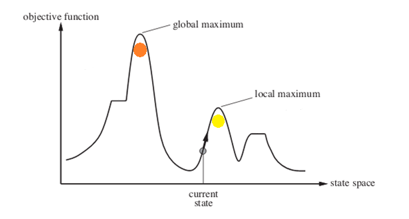

# مقدمة
في الذكاء الاصطناعي وخوارزمياته هناك الكثير من المشاكل العامة وسنذكر أغلبها أو بعض منها هنا في المقال

## بعض الخوارزميات

- خوارزمية تسلق الجبال / Hill Climbing

- خوارزمية البحث المتعمق أولاً / DFS

- خوارزمية البحث بالعرض أولاً / BFS

## BFS
تعد خوارزمية توصلك مباشرة للطريق الأقصر من البداية للنهاية , وهي بشكل عام سريعة الأداء وحلها ذو حل أمثل

[هنا درس تحليل الشبكات المرتبط بالخوارزمية](https://saadaiblog.netlify.app/blog/post12)

## DFS

وهي على العكس تماماً , حيث يكتمل البحث في كامل المكان بغض النظر وصل للحل الأمثل أم لا

### الخوارزميتين
 مواضيع هذه الخوارزميات مثل خوارزمية ديكسترا بالضبط في مجال تحليل وتصميم الخوارزميات والذي سنشرحه لاحقاً إن شاء الله.

## Hill Climbing

وهي خوارزمية تسلق الجبال , حيث يصل لنقطة عشوائية ثم يبحث في النقاط المجاورة لكن هناك الكثير من العقبات حول هذه الخوارزمية أبرزها :

- المنحدرات

- القمم العليا المحلية

حيث تظن الخوارزمية أنها في أعلى قمة موجودة

- الحواف

#### ملاحظة ختامية
بصراحة الموضوع ليس مفيد بشكل عام في الذكاء الاصطناعي لكن وجب ذكره والمرور عليه بشكل بسيط , لأن المواضيع الأكاديمية دائماً ماتمر على هذا الموضوع وتقوم من التضخيم بشأنه وكأنه لا ذكاء اصطناعي سوى هذه المواضيع مع غض النظر عن تعلم الآلة والتعلم العميق صلب الذكاء الاصطناعي بأكمله

وشكراً لقراءتك هذا المقال