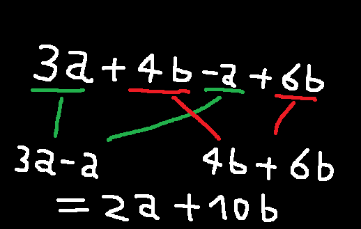
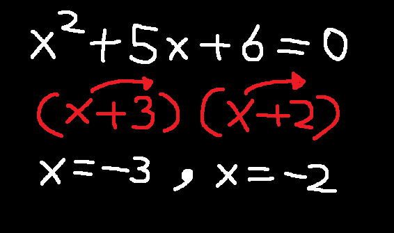
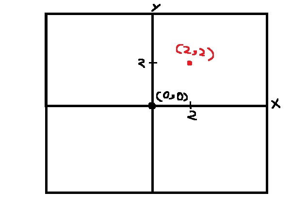
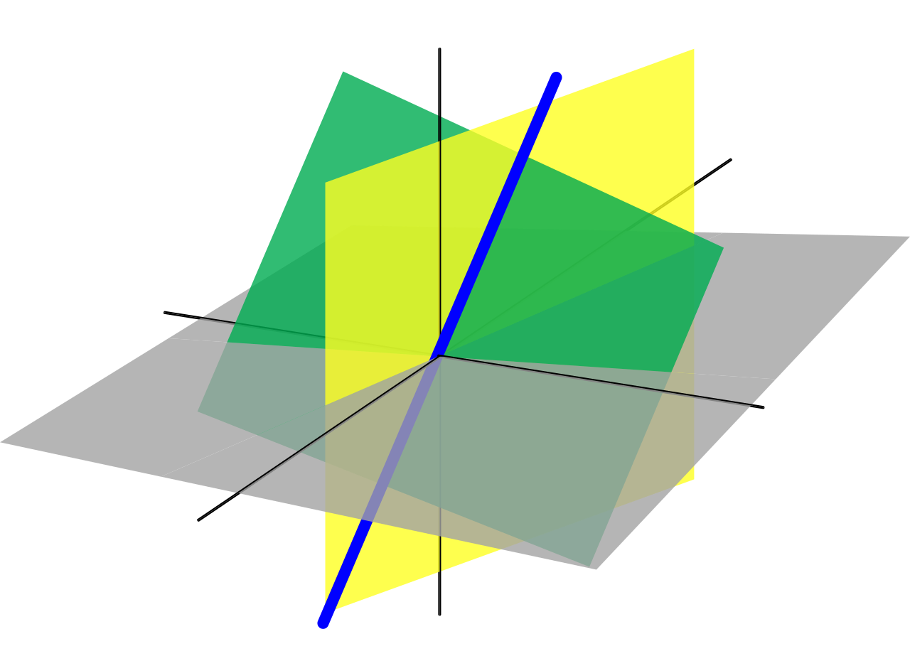
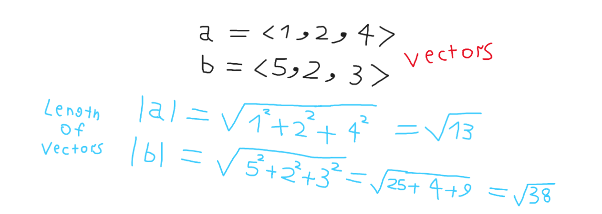

# مقدمة
الجبر الخطي هو من أهم فروع الرياضيات , وهو فرع من الرياضيات البحتة وفرع من علم الجبر الأساسي ويتناول الجبر الخطي موضوعات متعددة مثل الفضاءات المتجهية والأنظمة الخطية والمصفوفات وإلخ...

## مفهوم الجبر
الجبر هو فرع الرياضيات الذي يستبدل الأرقام بالحروف والرموز ذات الدلالات , والجبر الخطي هو من أهم فروع علم الجبر حيث يتناول مواضيع الجبر في أنظمة خطية.

### خطة الجبر الخطي

- Systems of Linear equations / أنظمة المعادلات الخطية

- Matrices and Determinates / المصفوفات والمحددات

- Operations of matrices / العمليات على المصفوفات

- Points and Vectors / النقاط والمتجهات

- 2D and 3D / ثنائي الأبعاد وثلاثي الأبعاد

- Introduction to NumPy / مقدمة لمكتبة نمباي الأساسية في بايثون

### معادلات جبرية

 

### التمثيل البياني للنقاط

لنفترض أنه لدينا نقطة (2,2) في تمثيل بياني ثلاثي الأبعاد فسيكون بهذا الشكل :

وهذا تمثيل الدوال في طريقة الرسم البياني

راجع من هنا درس ماقبل التفاضل والتكامل
[الرابط](https://saadaiblog.netlify.app/blog/post16.1)

ولكن ليس من الدائم أن يكون الرسم البياني عبارة عن محورين فقط أو في عالم ثنائي الأبعاد

### تمثيل بياني ثلاثي الأبعاد
وهو التمثيل الواقعي الذي يمثل حياتنا اليومية على 3 أبعاد :

1. الطول
2. العرض
3. الإرتفاع

وغالباً مايضيف الفيزيائيين بعداً رابعاً وهو :
4. الزمن
لكنه ليس محور حديثنا ولايهمنا كثيراً .

وتمثيل النقاط غالباً يكون نفس ماهو لكن مع إضافة بعد ثالث يؤثر قليلاً

### المتجهات / Vectors

هو عنصر مثل السهم بين نقطتين وغالبا مايكون من نقطة الصفر تجاه نقطة أخرى

من المتجه يمكن حساب طوله وحساب وحدة المتجه

طول المتجه = جذر كل عناصر المتجه مع تربيع كل عنصر وجمعها مع بعضها البعض

ويمكن بعد ذلك إيجاد وحدة المتجه أو ماتسمى :

`Unit vector`

وهو المتجه نفسه على طوله , حيث كل عنصر في المتجه ينقسم على طول المتجه كاملاً

### Matrices / المصفوفات

وهي محور حديثنا في الأساس , المصفوفة هي مجموعة أرقام داخل مكان معين ذو خصائص محددة.

يمكن من المصفوفات إيجاد :

- محدد المصفوفة

وذلك عن طريق الضرب القطري لكل عناصر المجموعة ثم الطرح وهو طريقة يطول شرحها

- جمع مصفوفتين

- ضرب مصفوفتين

- طرح بين مصفوفتين

- قسمة مصفوفة على مصفوفة

والمصفوفات التي نقصدها هي الـ :

`Matrix`

وهي المصفوفات ثنائية الأبعاد حصراً دون المصفوفات أحادية الأبعاد أو ثلاثية الأبعاد , راجع ذلك في كتابي برمجة المصفوفات

[الكتاب](https://github.com/Saad711T/Matrices-Arrays-Programming-minibook)

ومعرفة المصفوفات تحديداً مهمة قبل الدخول في تعلم مكتبة نمباي الرياضية في لغة بايثون , ونستخدم نمباي لإجراء حسابات رياضية جبرية معقدة ومن ضمنها تعديل إعدادات نماذج تعلم الآلة ووظائف أخرى .

## مصادر ومراجع :
- [ويكيبيديا - جبر خطي](https://ar.wikipedia.org/wiki/%D8%AC%D8%A8%D8%B1_%D8%AE%D8%B7%D9%8A)
- Calculus Book - For Dummies By Mark Ryan
- Pre Algebra Book - For Dummies
- [Freecodecamp - Precalculus](https://youtu.be/eI4an8aSsgw?si=iudMAu14eAEMtzYD)
- [Imperial college of London - Mathematics for Machine Learning: Linear Algebra on Coursera](https://www.coursera.org/learn/linear-algebra-machine-learning)
- [Deeplearning.ai - Linear Algebra for Machine Learning and Data Science on Coursera](https://www.coursera.org/learn/machine-learning-linear-algebra?specialization=mathematics-for-machine-learning-and-data-science)