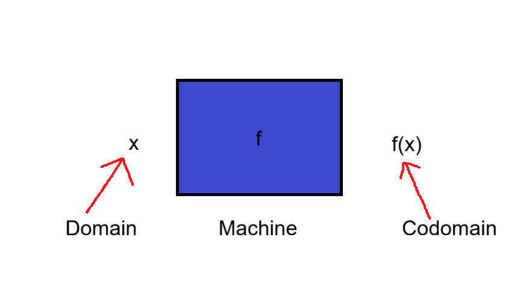
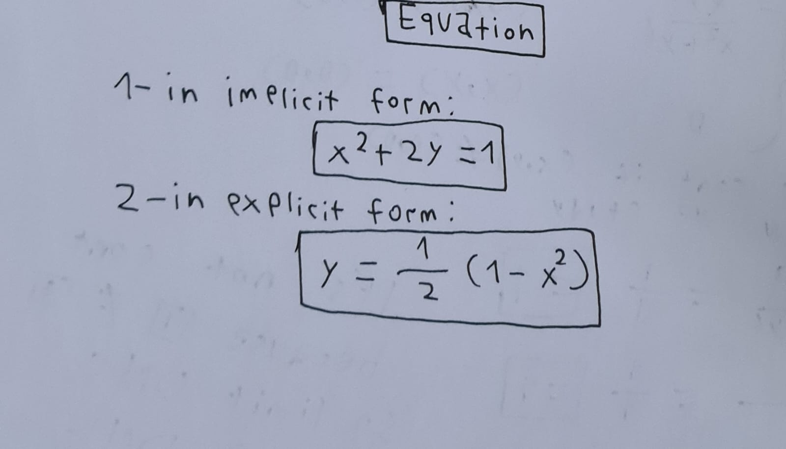
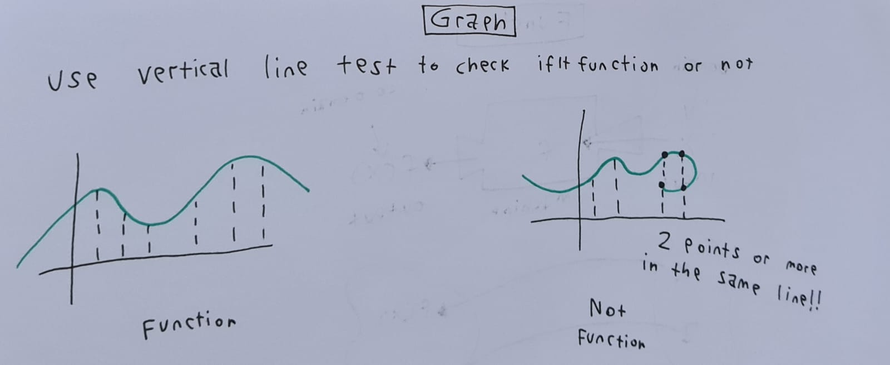
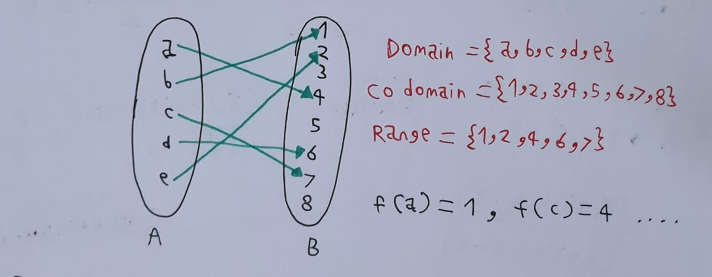
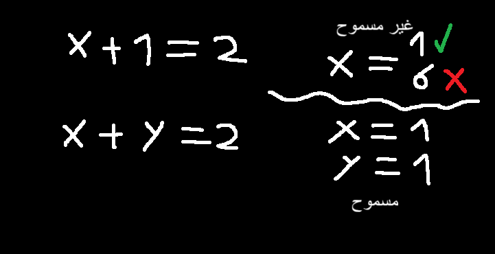
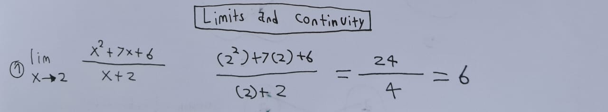
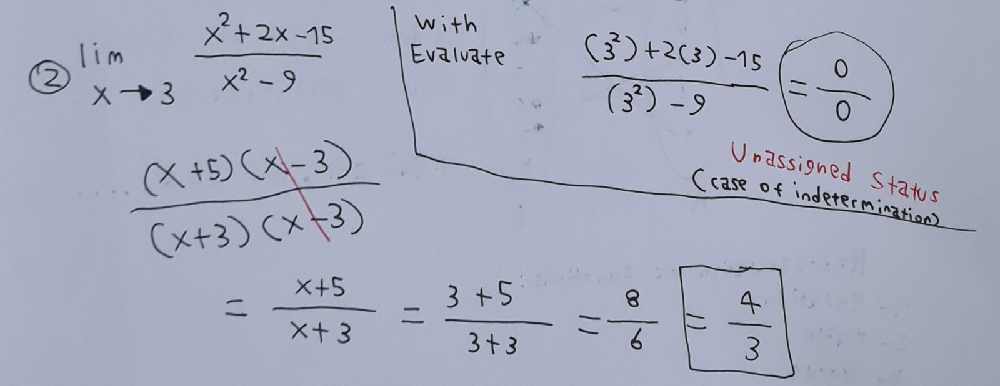

# مقدمة
قبيل الغوص والإبحار في التفاضل والتكامل , هناك متطلبات أساسية لهذا الفرع الرياضي وتسمى بحد ذاتها ماقبل التفاضل والتكامل

`Pre Calculus`

سنتناول في التدوينة هذه المواضيع بشكل موجز , قبل الدخول لتدوينات التفاضل والتكامل وأيضاً الجبر الخطي .

## المتطلبات
- أساسيات الرياضيات/Fundamentals of Math
- أساسيات الجبر/ Algebra Fundamentals
- بايثون بشكل بسيط / Basic Python

## الخطة
- الأرقام والمجموعات/Numbers and Sets
- الدوال/Functions
- الحدود والإتصال/Limits and Continuity

### الأرقام
هذه مجموعة الأرقام الطبيعية / Nature
`N = {1,2,3,..}`

وبإضافة ال0 تصبح من الأرقام الكلية / Whole
`W = {0,1,2,3,..}`

وهذه هي الأرقام الصحيحة / Integers
`Z = {...,-1,0,1,2,3,...}`

وهذه هي الأرقام الصحيحة الموجبة وهي متساوية مع الطبيعية / Positive Integers
`Z+ = {1,2,3,4,5,...}`

وهذه كلها من الأرقام المنطقية / Rational :
`Q {p/q | P∈Z and q≠0}`

وهذه كلها من الأرقام الحقيقية / Real numbers
`R`

وهناك أرقام غير منطقية / Inrational :
وهي لا تنتمي للأرقام الحقيقية بشكل مباشر
مثل القسمة على الصفر , والرموز مثل الباي وغيرها...

### المجموعات
المجموعة هي سلسلة من الأرقام والكائنات في مكان واحد

مثال :
`S={A,B,C,D}`

أمثلة , هل هي مجموعات أم لا ؟

1. `A = {1,2,3,4}` :
نعم مجموعة
عدد أصولها = 4

2. `{{100}}`
هذه مجموعة داخل مجموعة
عدد أصولها = 1

3. `{}`
مجموعة , لكنها مجموعة خالية ويرمز لها ب:
φ

4. `{{}}`
مجموعة داخل مجموعة , رغم أنها مجموعة خالية لكن المجموعة الداخلية تحسب كعدد من أصول المجموعة , عدد أصول المجموعة = 1

5. `{1,2,{3,5,6},6}`
نلاحظ هنا أنها مجموعة وبداخلها مجموعة , ولكن المجموعة الداخلية تحسب كأصل 1 بغض النظر عن عدد عناصرها , فلذلك عدد أصول عناصر المجموعة = 4

### الدوال
الدوال أو

Functions

هي تعمل مثل الآلة ومثل مفهوم الخوارزمية بعلوم الحاسب , فهي سلسلة من المخرجات تُعطى إليك بناء على مدخلاتك في البرنامج.

تسمى المدخلات بمجال , والمخرجات المجال المشترك .

طرق تمثيل الدوال :
- رسم بياني/Graph
- معادلة/Equation
- كتابة/Word
- جداول/Table

#### المعادلة

#### الرسم البياني

نلاحظ في الرسم أنه لايجب أن يكون هناك نقطتين في نفس المستوى الرأسي وإلا لن تكون دالة أساساً

#### الجدول

نلاحظ القيم في المجال والمجال المشترك , يجب أن يكون هناك فقط سهم واحد ينطلق من كل مجال وبدون أي سهم آخر من نفس القيمة وإلا لن يكون دالة , لكن مسموح بوصول أكثر من سهم لأكثر من مجال مشترك .

في الواقع تسمى الدالة التي فيها المجال المشترك يصل إليه أكثر من سهم ب"غير متباينة" أما عكس ذلك وهي تحقق شرط الدالة فهي "متباينة".

لماذا من غير المسموح أن ينطلق أكثر من سهم من كل قيمة في المجال ؟ لأنه من غير المنطقي أن يصبح المتغير ذو قيمتين في نفس الوقت , ولكن منطقي جداً أن يكون هناك متغيران يحملان نفس القيمة .

### الحدود

هناك طريقتين رئيسية لحل معادلات الحدود

1. بالتعويض
وهذه الطريقة سهلة جداً , وسبق وقمنا بأخذها في أيام المدرسة

ولكن... أحياناً قد تصل لناتج صفر قسمة صفر وهي نتيجة غير معرفة , وبالطبع ليس هناك حد نتيجته غير معرفة وهذه حالة شهيرة تسمى بحالة عدم التعيين ونستعين بالطريقة الثانية لحلها :

2. بالحذف والتبسيط الرياضي

وفي عالم التفاضل والتكامل أغلب الحدود ستكون حالة عدم تعيين فيجب أن تستعين وتستخدم الطريقة الثانية بشكل إجباري.

## مصادر ومراجع :
- [Deeplearning.ai - Calculus for Data Science and AI in Coursera](https://www.coursera.org/learn/machine-learning-calculus)
- Calculus Book - For Dummies By Mark Ryan
- Pre Algebra Book - For Dummies
- [Introduction to Calculus - University of Sydney](https://www.coursera.org/learn/introduction-to-calculus)
- [Dr.Ahmed Hajaj - Calculus for AI](https://www.youtube.com/playlist?list=PLxIvc-MGOs6gkSl_PPAVJpebKDLo-ijEC)
- [أنا حر - مدخل للتفاضل والتكامل](https://www.youtube.com/@anaHr/playlists)
- [Freecodecamp - Precalculus](https://youtu.be/eI4an8aSsgw?si=iudMAu14eAEMtzYD)