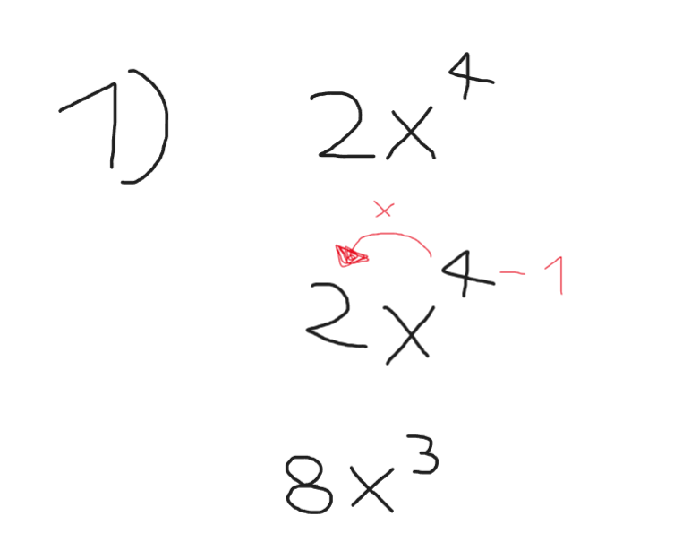
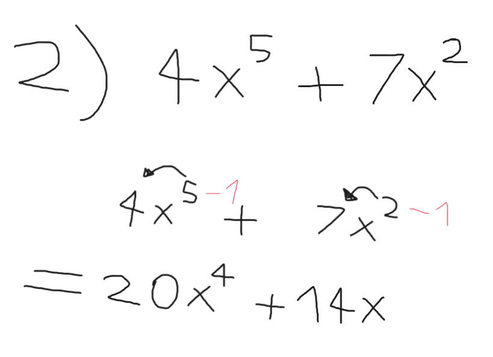
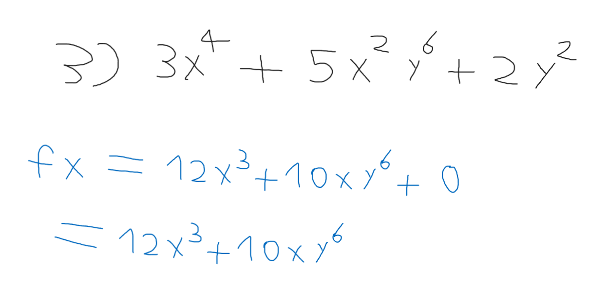
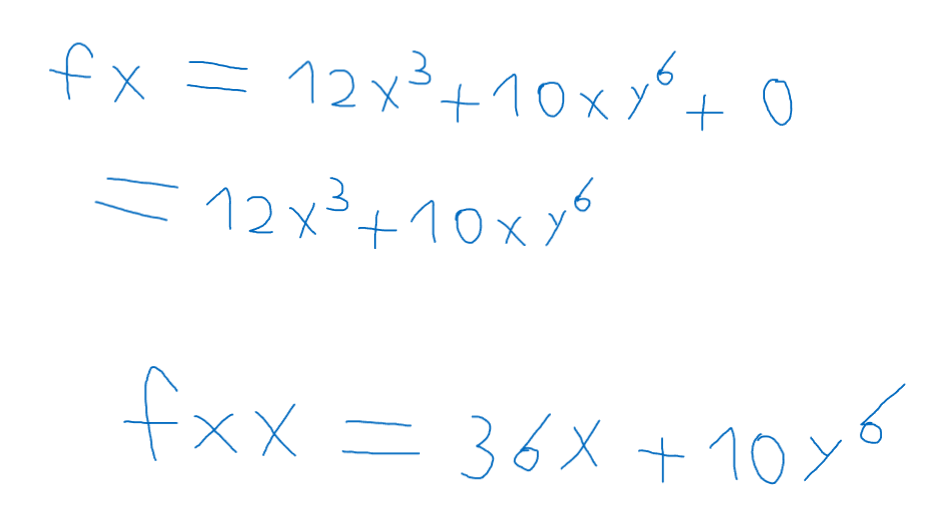

# مقدمة
هنا الشطر الأول من التفاضل والتكامل وهو الشطر الذي يخص التفاضل وعمليته الأساسية التي تسمى الإشتقاق أو

Derivative

الإشتقاق يعبر عن معدل تغير قيمة واي نتيجة تغير قيمة اكس بشرط وجود دالة أو علاقة رياضية بين القيمتين .

## الصيغ
طبعاً كما نعرف أن التفاضل والتكامل تم تطويرها بواسطة الفيزيائي الشهير إسحاق نيوتن وعالم الرياضيات غوتفريد لايبنتز بشكل مستقل عن بعضهما البعض , والإشتقاق هو واحد من هذه المفاهيم التي أختلفا عليها كثيراً

#### صيغة لايبنتز
$$
\frac{d f(x)}{dx}
$$

#### صيغة نيوتن
$$
x_{n+1} = x_n - \frac{f(x_n)}{\dot{f}(x_n)}
$$

## مفهوم الإشتقاق
ببساطة الإشتقاق كالآتي , هي نقل الرقم في الأس قبل المتغير وطرح 1 من قيمة الإكس

### أمثلة بسيطة

نلاحظ في الصورة
$$
\ 2x^4
$$

تم أخذ ال4 وتم ضربها بال2 وهي معامل قيمة الإكس وأصبحت :

$$
\8x
$$

ثم تم طرح 1 من الأس , حيث أصبحت

$$
\8x^3
$$

المثال كالآتي :
$$
\ (4x^5) + (7x^2)
$$

هنا يجب اشتقاق الطرف الأول ثم اشتقاق الطرف الثاني وإبقاء الجمع كما هو لأنهم ليسوا من نفس الدرجة

### قاعدة عامة
مشتقة أي رقم صحيح = 0

مشتقة 7 ؟
0

مشتقة 10 ؟
0
وإلخ...

## الإشتقاق الضمني / Partial Derivative

وهو الإشتقاق بالنسبة لإكس مثلا لمعادلة كاملة , او اشتقاق اكس من اشتقاق الإكس نفسه

يتم تعريفها بهذا الشكل

$$
fx
$$

وكذلك مشتقة الاكس بالنسبة لمشتقة الاكس هكذا :

$$
fxx
$$

$$
(3x^4) + (5x^2 y^6) + 2y^2
$$

نلاحظ هنا أنه تم اشتقاق كل قيم الإكس وتم التغاضي عن كل قيم الواي قدر الإمكان
فمثلاً

$$
\ 2y^2
$$

تم إعتبارها بصفر لأنه ليس فيها أي اكس

أما التالية :
$$
(5x^2 y^6)
$$
فتم إشتقاق الإكس وابقاء الواي موجودة لأنه هناك بينهم علاقة ضرب مع الإكس ولسنا قادرين على محوها في الإشتقاق الضمني الأول

وهنا اشتقينا الإكس بالنسبة لإشتقاق الإكس , ويمكن تكرار العملية مرات عدة وحتى بالنسبة للواي وأي متغير آخر موجود في المعادلة .

## الفائدة ؟
إيجاد المشتقات وخصوصاً المشتقات الضمنية يفيد لاحقاً بالإرتباط مع الجبر في بعض الدروس المهمة في التفاضل والتكامل أهمها :

- Maximum , minimum and saddle values

وهي مهمة في عالم خوارزميات تعلم الآلة وخصوصاً خوارزمية الإنحدار المتدرج أو

`Gradient Descent`

وهي خوارزمية تفاضلية مهمة للغاية في عالم تعلم الآلة والذكاء الاصطناعي

- إرتباطها بالجبر الخطي والإحصاء

يعد التفاضل والإشتقاق من المواضيع المهمة المرتبطة برياضيات تعلم الآلة ولاسيما الجبر الخطي والإحصاء والإحتمالات .

## مصادر ومراجع :
- [Deeplearning.ai - Calculus for Data Science and AI in Coursera](https://www.coursera.org/learn/machine-learning-calculus)
- Calculus Book - For Dummies By Mark Ryan
- [Introduction to Calculus - University of Sydney](https://www.coursera.org/learn/introduction-to-calculus)
- [Dr.Ahmed Hajaj - Calculus for AI](https://www.youtube.com/playlist?list=PLxIvc-MGOs6gkSl_PPAVJpebKDLo-ijEC)
- [أنا حر - مدخل للتفاضل والتكامل](https://www.youtube.com/@anaHr/playlists)
- [Freecodecamp - Calculus](https://youtu.be/HfACrKJ_Y2w?si=GH4hpiW67YaMbAer)