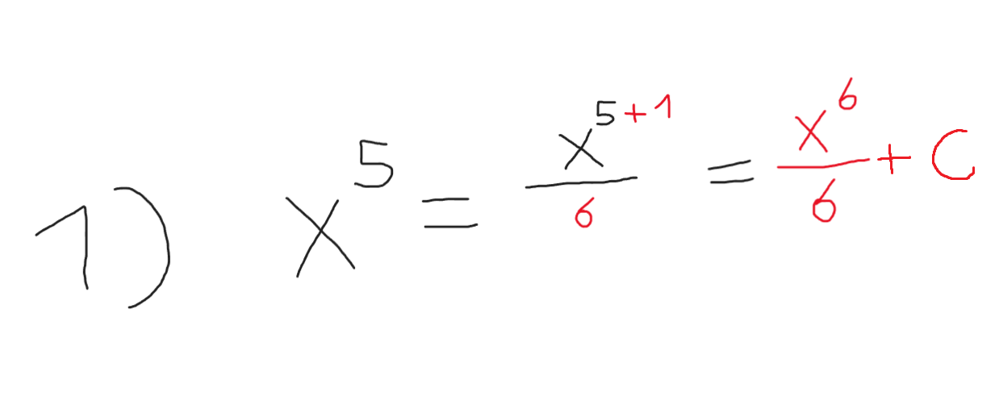
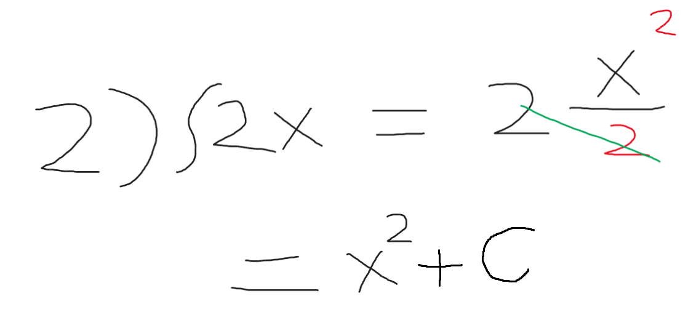

# مقدمة
هنا الشطر الثاني من التفاضل والتكامل وهو الخاص بعملية التكامل , التكامل عكس الإشتقاق بشكل تقريبي ويعبر عن الآتي تحديداً :

تكامل لدالة معينة هو تجميع كميات متناهية الصغر للحصول على كمية كلية

#### صيغة لايبنتز للتكامل
$$
\int f(x)\, dx
$$

#### صيغة نيوتن للتكامل

$$
F'(x) = f(x) \;\;\Longrightarrow\;\; \int f(x)\, dx = F(x) + C
$$

## مفهوم التكامل
زيادة الأس بمقدار 1 ووضع نفس الرقم في المقام كعملية قسمة

### أمثلة بسيطة

نلاحظ في الصورة
$$
\ x^5
$$

قمنا بزيادة الأس + 1 , ثم أخذنا الرقم ووضعناه في المقام كعملية قسمة

$$
\frac {x^6}{6} + C
$$

السي هو ثابت التكامل وهو شيء ثابت في عمليات التكاملات .

$$
\ 2x
$$

قمنا بزيادة الأس 1 ثم وضعها بعملية قسمة مع وضع قيمة الأس في المقام , لكن هنا نلاحظ أن ال2 الموجودة في معامل الإكس تم حذفها مع ال2 بالمقام .

فأصبح الناتج النهائي

$$
\ x^2 + C
$$

### تنويه
بالطبع مجال التكامل أعمق من هذا بكثير , فهناك قواعد تكامل الدوال المثلثية , والتكامل اللانهائي والتكامل المحدود لكن الأهم هو اكتساب فكرة عامة عن التكامل بشكل مبسط وليس أخذ كل التكامل الموجود في مقالة واحدة بالضبط كما كتبت في المقالة السابقة الخاصة بالإشتقاق والتفاضل

###### السبب ؟
لأنه ببساطة هذه مجرد مقدمة لرياضيات تعلم الآلة والتي غالباً سنستخدم طرق برمجية فيها مثل إستخدام مكتبة نمباي وغيرها , فيجب عليك كمهندس تعلم آلة أخذ فكرة عامة عن هذا المجال.

## مصادر ومراجع :
- [Deeplearning.ai - Calculus for Data Science and AI in Coursera](https://www.coursera.org/learn/machine-learning-calculus)
- Calculus Book - For Dummies By Mark Ryan
- [Introduction to Calculus - University of Sydney](https://www.coursera.org/learn/introduction-to-calculus)
- [Dr.Ahmed Hajaj - Calculus for AI](https://www.youtube.com/playlist?list=PLxIvc-MGOs6gkSl_PPAVJpebKDLo-ijEC)
- [أنا حر - مدخل للتفاضل والتكامل](https://www.youtube.com/@anaHr/playlists)
- [Freecodecamp - Calculus](https://youtu.be/HfACrKJ_Y2w?si=GH4hpiW67YaMbAer)