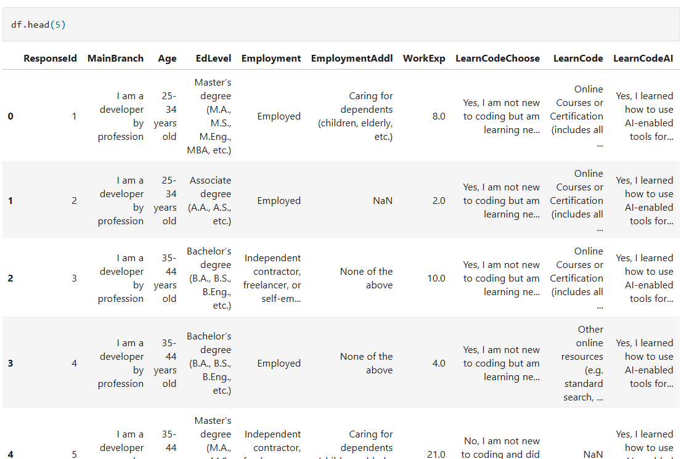

# مقدمة
شاهد المقالة السابقة لمعرفة أهمية المكتبة وطريقة إستخدامها قبل رؤية هذه المقالة

[من هنا](https://saadaiblog.netlify.app/blog/post17.qmd)

## تضمين المكتبة

```{python}
import pandas as pd
```

نلاحظ هنا أنه يجب علينا الإلتزام بالاسم الذي أطلقناه على المكتبة وهو :

`pd`

وهذا الكلام عام على أي مكتبة في بايثون

### الأوامر الأساسية

``
pd.read_csv('data/data.csv')
``

أمر قراءة ملف ذو صيغة :

**CSV**

---

``
pd.read_excel('data/data.xlsx')
``

أمر قراءة ملف مايكروسوفت إكسل

[اقرأ هنا مايكروسوفت إكسل لتحليل البيانات](https://saadaiblog.netlify.app/blog/post8.6.qmd)

---

``
df = pd.read.csv('data.csv')
``

وضع ملف نصي داخل متغير

ويمكن الرؤية والقراءة من الملف بالأوامر التالية :

``
df.head()
``

حيث يظهر هذا الأمر الصفوف الأولية من البيانات

ويمكن إضافة رقم بين القوسين بهذا الشكل :

``
df.head(5)
``
حيث يظهر بالضبط الصفوف الأولية الخمسة



وكذلك النقيض تماماً هو الأمر التالي :

``
df.tail()
``

وهو يظهر الصفوف الأخيرة في البيانات

---

يمكن كذلك في بانداس تحديد الصفوف والأعمدة المطلوبة لتجهيزها في عملية تعلم الآلة

مثلاً :

``
ages = df['Age'].value_counts()
``
حيث حفظنا عمود الأعمار في بيانات موجودة عندنا محفوظة في بانداس مسبقاً وحفظناها في هذا المتغير , ويسهل علينا لاحقاً تدريب النموذج عليها .

بل ويمكن أيضاً تنظيف البيانات وإزالة الأعمدة غير الضرورية بأمر :
``
dropna()
``

مع ضرورة تحديد المتطلبات بين القوسين كالآتي :

``
ages.dropna(axis=0, how='any', thresh=None, subset=None, inplace=False)
``

#### الخلاصة

تعلمنا في هذه المقالة الأوامر الأساسية لمكتبة بانداس الخاصة بمعالجة البيانات تحديداً وتجهيزها لعملية تعلم الآلة وتدريب النموذج .

## مصادر ومراجع :
- [Pandas - Official site](https://pandas.pydata.org/)
- [بانداس - ويكيبيديا](https://ar.wikipedia.org/wiki/%D8%A8%D8%A7%D9%86%D8%AF%D8%A7_(%D8%A8%D8%B1%D9%85%D8%AC%D9%8A%D8%A9))
- Data Science Programming Book - For Dummies