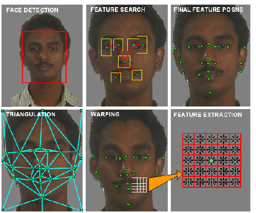

# مقدمة
لدى الذكاء الإصطناعي إستخدامات وتطبيقات واسعة في مجالات واسعة , وأبرز ماذكرناها هو في الهندسة والطب والفيزياء والعلوم والبرمجة , تطور الذكاء الإصطناعي من مجرد مصطلح بسيط إلى شركات ومؤسسات ذات قيمة سوقية عالية ومشاريع ثورة رقمية تغير واقعنا بشكل أو بآخر .

## تطور الذكاء الإصطناعي :
1. في الخمسينات : تجربة الآن تورنج
2. في السبعينات نهضت `الأنظمة الخبيرة`
3. نشأة مفهوم `تعلم الآلة` منذ الخمسينات وتطوره بشكل باهر في اوائل الثمانينات وتحديداً 1981 م
4. في فترة التسعينات أتت فترة `الشبكات العصبية`
5. صعود وتطور مفهوم `التعلم العميق` في الألفية الجديدة وحتى عقد 2010 م
6. ظهور وكلاء الذكاء الإصطناعي وفترة النماذج اللغوية الكبيرة بعد إطلاق النموذج الشهير شات جي بي تي في نوفمبر 2022 م

### الذكاء الإصطناعي في الحياة اليومية
أصبح يشكل الذكاء الإصطناعي شيء ضروري في حياتنا اليومية وبعض الأحيان لاغنى عنه !!! وأمثلة على ذلك :

##### مساعد الذكاء الإصطناعي

نماذج ذكاء إصطناعي تساعد على تنظيم الحياة اليومية مثل أليكسا ومساعد جوجل

##### أنظمة التوصيات

أنظمة ذكاء إصطناعي بسيطة مدمجة في مواقع الويب مثل نتلفكس ويوتيوب لإقتراح مقاطع فيديو مناسبة للمشاهد

##### نظام التعرف على الوجه

نظام ذكاء إصطناعي متقدم مبني بالشبكات العصبية للتعرف على الأشخاص من وجوههم

### أنواع الذكاء الإصطناعي حسب قوة التدريب :

- ذكاء إصطناعي ضعيف : غالباً تم تدريبه فقط لشيء محدد وشديد التخصيص مثل نظام التوصيات والإقتراحات
- ذكاء إصطناعي عام : وهو غالباً يُدرب على بيانات في مختلف المجالات لكي يجيب على الاسئلة ويتخذ القرارات ويعطي إنطباعات وآراء
- ذكاء إصطناعي خارق : وهي أنظمة ذكاء إصطناعي متقدمة في التعلم العميق وتستخدم تقنيات متقدمة جداً وتستخدم عادة في الأمور التي تتطلب هذا النوع من الأنظمة مثل الشؤون العسكرية والطبية , غالباً حتى الذكاء الإصطناعي العام يصبح خارقاً في عدة مجالات إذا تم تكثيف تدريبه فيها

## مصادر ومراجع :
- [ويكيبيديا - الذكاء الإصطناعي](https://ar.wikipedia.org/wiki/%D8%B0%D9%83%D8%A7%D8%A1_%D8%A7%D8%B5%D8%B7%D9%86%D8%A7%D8%B9%D9%8A)
- [IBM Introduction to Artificial Intelligance - Coursera](https://www.coursera.org/learn/introduction-to-ai)
- [Britannica - History of AI](https://www.britannica.com/science/history-of-artificial-intelligence)