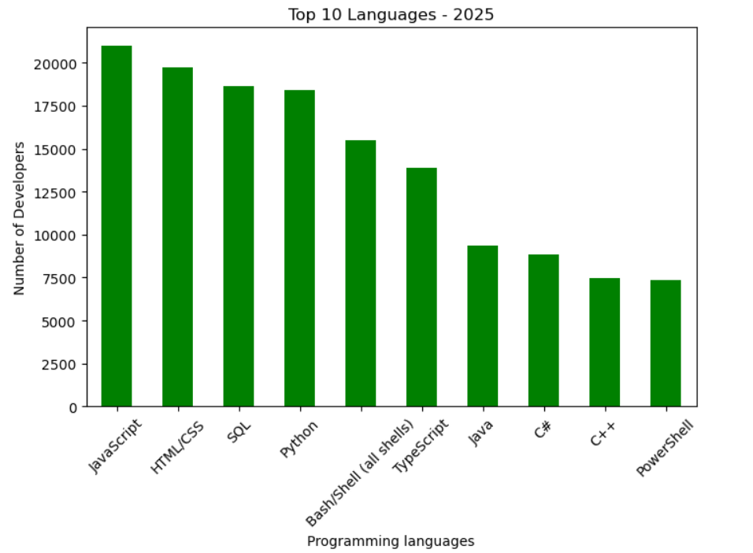
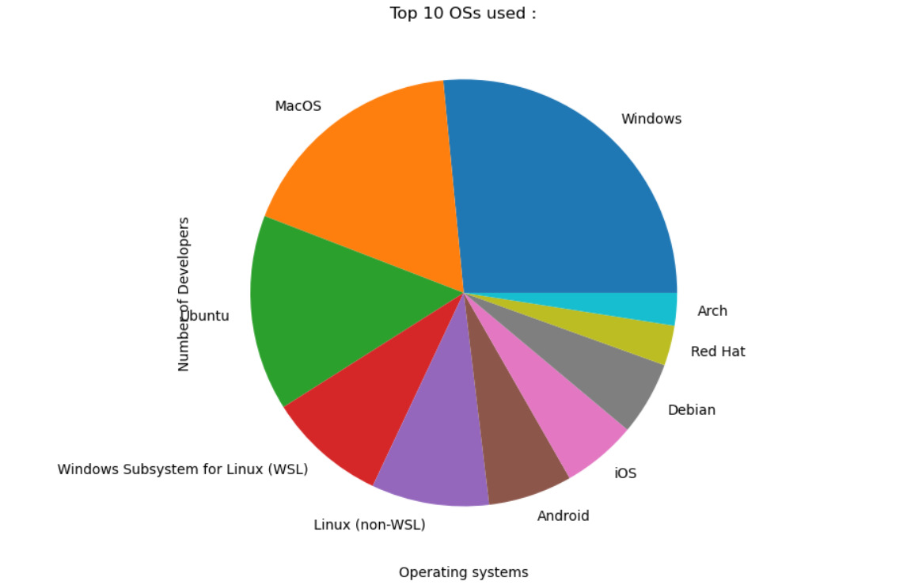
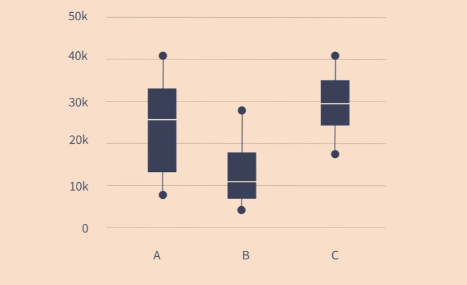
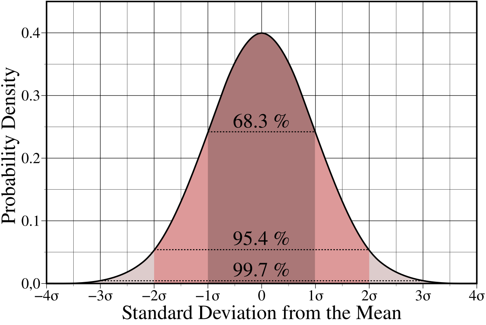
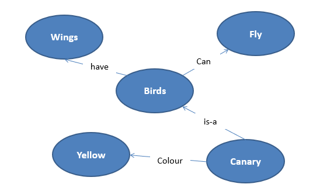
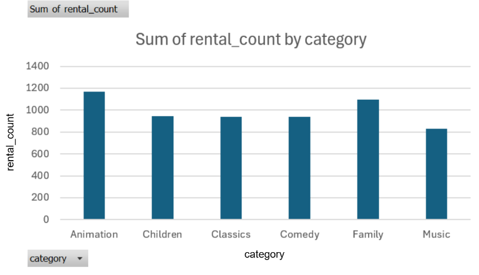
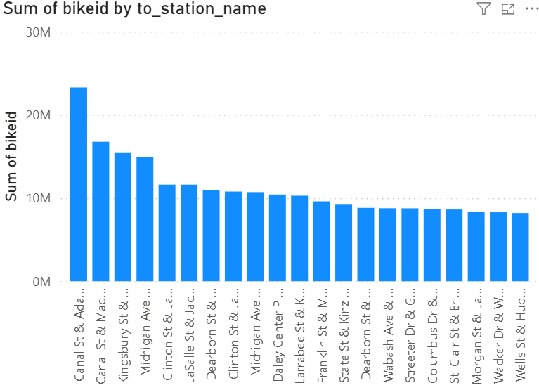

# مقدمة
غالباً ماتُمثل البيانات في صفوف وأعمدة ولكن هناك مجال كامل لتمثيل البيانات أو رسم البيانات , وهو يساعدنا في إتخاذ القرار وعملية التأكد من البيانات بشكل رسومي واضح لفهم الإنسان

## تمثيل البيانات - Data Visualization

هي طرق رسم البيانات على عدة أشكال أبرزها :

- Bars/أعمدة
- Pie / كعكة دائرية
- Gauge / عداد قياسي
- Area / مساحات
- Boxplot / صندوقي
- Donut / دونات
- Heatmap / خريطة حرارية
- Statistical Distribution / توزيع إحصائي
- Scatter Plot / نقاط مبعثرة
- Networks / شبكات مترابطة

وهذه أبرز أشكال البيانات المرسومة والتي سنستعرضها في هذا المقال ونتكلم عن أبرز الأدوات

### Bars-أعمدة
هي الشكل الأبرز والأشهر لتمثيل البيانات حيث تمثل البيانات على شكل أعمدة متلاصقة أو متفرقة , تصعد للقمة ممثلة قيمة معينة

وغالباً تكون مفيدة في عمليات الإحصاء كالتعداد السكاني والقياسات الإحصائية .

### Pie-رسم دائري
هو رسم بياني ثاني شهير حيث تٌقسم دائرة معينة على عدد من الحالات أو الأوصاف بناء على البيانات المعطاة وتنطلق من نقطة المنتصف مشكلة قطعة بارزة كقطعة الكعك أو قطعة البيتزا .

### Boxplot- رسم صندوقي
هو رسم إحصائي مهم في عالم الذكاء الاصطناعي وعلم البيانات عن تمثيل البيانات على شكل صناديق لمعرفة القيم الشاذة من بينها أو ماتسمى بـ :

`Outliers`

### Statistical distribution - توزيع إحصائي
وهو من أهم النقاط والمزايا في عالم تمثيل وتحليل البيانات , إذ أن الإحصاء جزء أساسي من هذا المجال

التوزيعات الإحصائية نوعين إما متصلة أو منفصلة , وأبرز المنفصلة مثل :
- توزيعة بواسون
- توزيعة باينوميال
- توزيع هندسي

والتوزيع المتصل البارز هو :
- التوزيع الطبيعي

هنا راجع مقال :

[أهمية الإحصاء](https://saadaiblog.netlify.app/blog/post24)

### Network - شبكة متصلة
حيث عدداً من العُقد مربوطة ببعضها البعض بروابط ولعل أبرز أشكال الشبكات :

- Semantic network - شبكة دلالية

وهي نوع معين من الشبكات المفيد بعالم الذكاء الاصطناعي لوصف قاعدة المعرفة المبسطة لدينا

[من هنا مقالة تحليل الشبكات](https://saadaiblog.netlify.app/blog/post12)

### Scatter - نقاط مبعثرة
وهو تمثيل بياني لنقاط منتشرة بشكل مبعثر في التمثيل البياني

وأبرز مثال عليها هو خوارزمية التجميع أو

`Clustring`

وهي من خوارزميات تعلم الآلة غير الخاضعة للإشراف , وأهمية رسم نقاط الإنتشار المبعثرة تكمن في معرفةالعلاقات والأنماط بين النقاط في تمثيل بياني .

[شاهد مقالة مقدمة في تعلم الآلة](https://saadaiblog.netlify.app/blog/post7)

#### الأدوات البارزة
في عالم تمثيل البيانات يمكننا إستخدام الكثير من الأدوات القوية ولعل أبرزها :

- مايكروسوفت إكسل :

برنامج جداول بسيط من شركة مايكروسوفت ومن ضمن حزمة أوفيس الشهيرة , يمكنك تمثيل البيانات فيه بشكل أبسط مما تتوقع

[مايكروسوفت إكسل لتحليل البيانات](https://saadaiblog.netlify.app/blog/post16)

- مايكروسوفت باور بي آي :

أداة مايكروسوفت الشهيرة لذكاء وتحليل الأعمال , وهي متخصصة بشكل قوي جداً في الرسومات البيانية وتمثيل البيانات

- تابلو :
  
وهو برنامج ذكاء وتحليل أعمال وتمثيل بيانات منافس لمايكروسوفت باور بي آي

- مكتبات بايثون

هناك مكتبات شهيرة لتمثيل البيانات والتي يستخدمها علماء البيانات ومهندسي الذكاء الاصطناعي مثل : ماتبلوتيب - سيبورن - بايبلوت وغيرها الكثير والكثير...

## مصادر ومراجع :
- [Datalab - الرسوم البيانية](https://usedatalab.com/%D8%A7%D9%84%D8%B1%D8%B3%D9%88%D9%85)
- [IBM - Data Visualization with python on Coursera](https://www.coursera.org/learn/python-for-data-visualization)
- Data Science Programming Book - For Dummies
- [Tableau - What is data visualization ?](https://www.tableau.com/visualization/what-is-data-visualization)