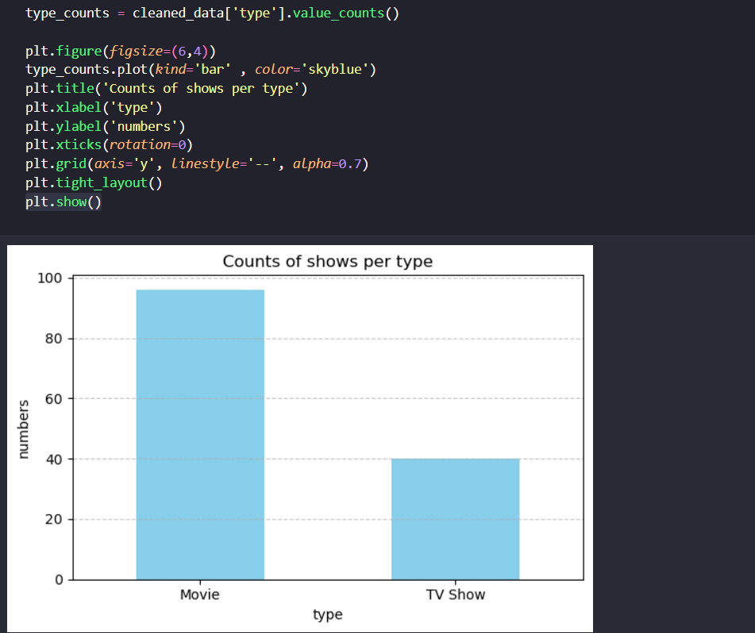

## المكتبة
تعد المكتبة من أهم مكتبات تمثيل البيانات في لغة بايثون , وسنشرح في المقالة تثبيت المكتبة وإستخدامها الأبرز في تحليل وتمثيل البيانات

كما أنه بنيت على عدد من المكتبات الشهيرة لاحقاً في مجال تحليل وتمثيل البيانات مثل :

- Seaborn

- GeoPandas

- دوال الرسم المبنية ببانداس على ماتبلوتليب :

والتي سنستخدمها اليوم


### تحميلها
لتحميل المكتبة عليك تنفيذ الأمر الآتي في تيرمنال جهازك بعد التأكد من تثبيت لغة بايثون :
`pip install matplotlib`

## عمل المكتبة
طبعاً بعد تحديد الصفوف والأعمدة وتنظيف وتحليل البيانات الخاصة بك سواء بإستخدام مايكروسوفت إكسل أو مكتبة متقدمة مثل بانداس

[الجزء الأول من شرح مكتبة بانداس](https://saadaiblog.netlify.app/blog/post17)

ستكون قادراً بعد تحديد الصفوف والأعمدة على رسمها بهذه المكتبة القوية جداً

أولاً نستدعي المكتبة بهذا الشكل في لغة بايثون :

```{python}
import matplotlib.pyplot as plt
```

ويجب أن تلتزم بالإختصار الذي وضعته للمكتبة , ونحن وضعنا هذا الإختصار لأوامرها :

**plt**

<hr>

لنفترض أنه لديك بيانات متجر أفلام معين , وحددت أنت الأمور المطلوبة من البيانات وهي كالآتي :

`column_needed = ["type","country","release_year"]`

نوع الفيلم وسنة إصداره والبلد الذي تم إصداره فيه , وذلك 

وقمت بنسخها في متغير بإستخدام مكتبة بانداس بهذا الشكل :

`cleaned_data = df[column_needed].copy()`

ثم حددت العمود الذي تريد رسمه بالضبط من خلال هذا المتغير بهذا الأمر :

`type_counts = cleaned_data['type'].value_counts()`

وأيضاً بإستخدام مكتبة بانداس

حينها ستتمكن من رسم هذا العمود بإستخدام مكتبة ماتبلوتليب بهذا الشكل :

`plt.figure(figsize=(6,4))`

وهو أمر يخص حجم الرسمة الذي تريده ويمكنك تغيير الطول والعرض بسهولة

ثم هذا الأمر :
`type_counts.plot(kind='bar' , color='skyblue')`

حيث أنت تستخدم دالة :

**plot**

وهي دالة رسم في بانداس تستخدم مكتبة ماتبلوتليب

إستخدمناها مع متغير أنواع الأفلام الذي عرفناه مسبقاً

أما

`kind='bar'`
فهو نوع الرسمة الذي تريده , هنا حددنا أننا نريدها رسمة بيانية عمودية , وبإمكانك تغييرها لرسمة دائرية والعديد من رسومات تمثيل البيانات
مثلاً :
`kind='pie'`

[راجع أولاً مقالة تمثيل البيانات لمعرفة أنواع الرسوم البيانية والفروقات](https://saadaiblog.netlify.app/blog/post20)

ثم :

`color='skyblue`
وهو لون الرسم البياني الذي تريده وببساطة يمكنك تغيره بإسم اللون الذي تريده

ثم هذا الأمر بعد الأمر السابق :
`plt.title('Counts of shows per type')`
وهو عنوان الرسم البياني الذي تريده ببساطة .

ثم أمرين مهمة جداً :

`plt.xlabel('type')`

<br>

`plt.ylabel('numbers')`

وهي تحديد عناوين محور إكس ومحور واي في الرسمة

والأمر الأهم وهو :
`plt.show()`
حيث هو أمر طباعة الرسمة أمامك بشكل مباشر



### ملاحظة
يمكنك إستخدام المكتبة في لغة بايثون في أي محرر أكواد عادي , لكن الإستخدام الشائع لها هو في بيئة جوبيتر كي لاتضطر للقيام بتشغيل الكود مرة تلو الآخر , بل في خلية واحدة في المشروع .

## مصادر ومراجع :
- [Matplotlib Documentation](https://matplotlib.org/stable/index.html)
- Data Science Programming Book - For Dummies