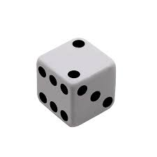

# مقدمة
حينما يُذكر مجال الإحصاء غالباً مانذكر معه نظرية الاحتمالات , والاثنان يشكلان معاً فرعاً مهماً من فروع الرياضيات التطبيقية والتي سنشرح كل واحد منها بشكل منفصل

## الإحصاء
الإحصاء هو مجال من مجالات الرياضيات التطبيقية ومن أهمها , يعد الإحصاء هو مجال دراسة جمع وتحليل وتنظيم البيانات للمساعدة في عمليات إتخاذ القرار

وكان مجالاً رياضياً بحتاً حتى أتى مجال تحليل البيانات التقني والإداري فأنفكت حصريتها بمجال الرياضيات

ونظرية الاحتمالات تعد الأساس الرياضي الذي يقوم عليه مجال الإحصاء .

## الاحتمال
الاحتمال هو قياس إمكانية حدوث حدث ما ويُقاس برقم بين الصفر والواحد , حيث يدل الصفر على إستحالة حدوث الحدث والواحد على تأكيد حدوثه .

النرد هنا مثلاً هو أحد أبرز أمثلة الاحتمالات , إذ أن كل رقم من أرقام النرد نسبة حدوثه هو :

$$
\frac{1}{6}
$$

إذ أنه لديك 6 أوجه للنرد ومع كل رمية سيظهر واحد منها فقط

أو مثلاً رمي عملة نقدية

فإن نسبة حدوث الشعار هي :

$$
\frac{1}{2}
$$

وهي مكافئة للنصف أو :

**50%**

ويعد مجال الإحصاء والاحتمالات من أهم مجالات الرياضيات في علوم الحاسوب وفروعه مثل علم وتحليل البيانات وكذلك التشفير وأيضاً بلا شك الذكاء الاصطناعي , إذ أن الإحصاء يستخدم في كثير من خوارزميات الألعاب في عالم الذكاء الاصطناعي من ضمنها :

- MINMAX

وكذلك في مجال تحليل البيانات مثل مقياس الكشف عن القيم الشاذة :

- Z-Score

[هنا مقالة أهمية الإحصاء](https://saadaiblog.netlify.app/blog/post24)

## مصادر ومراجع :
- [ويكيبيديا - احتمال](https://ar.wikipedia.org/wiki/%D8%A7%D8%AD%D8%AA%D9%85%D8%A7%D9%84)
- [DataRobot - Statistics and machine learning: what’s the difference?](https://www.datarobot.com/blog/statistics-and-machine-learning-whats-the-difference/)
- [Probability and Statistics for Machine learning and Data science - Deeplearning.io on coursera](https://www.coursera.org/learn/machine-learning-probability-and-statistics)