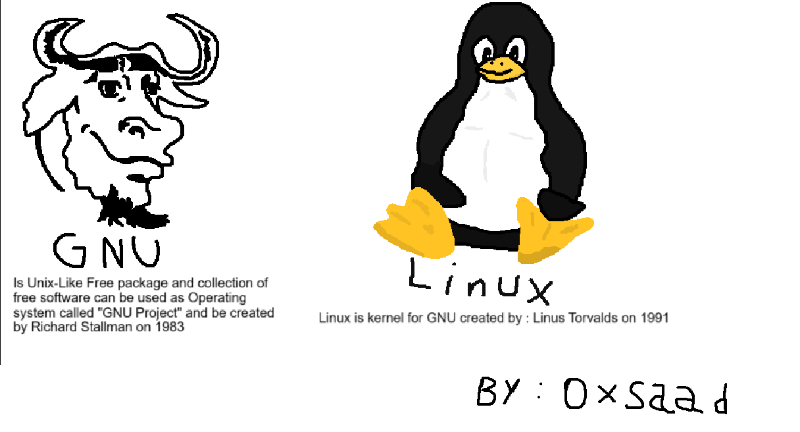
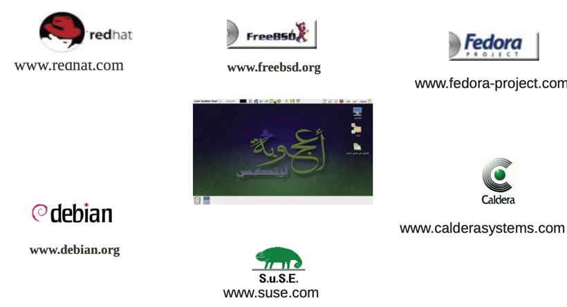

# تاريخ

في عام 1970 تم إنشاء نظام تشغيل يونكس , في مختبرات شركة :

AT&T

وكان ذلك في أواخر الستينات واوائل السبعينات , وتم إستخدام لغة الأسيمبلي مبدئياً ثم لاحقاً لغة سي , وفي الأساس منشئ لغة سي دينيس ريتشي كان ضمن طاقم عمل نظام تشغيل يونكس .

نظام تشغيل يونكس كان نظام مغلق المصدر مثل ويندوز اليوم , وكان يعامل كل شيء كأنه ملف ويسمح بكلاً من :

- `Multi-users` : السماح لعدة مستخدمين في نفس الجهاز

- `Multi-tasking` : السماح بتنفيذ عدد من البروسيسز والبرامج في وقت واحد , وكان شيئاً فريداً حينها

نظام تشغيل يونكس فتح آفاقاً واسعة حيث كل الأنظمة قبله كانت بدائية جداً , وألهم شخص يدعى ريتشارد ستالمان.

## جنو

مشروع جنو هو مشروع نظام تشغيل مفتوح المصدر ويعد من اوائل المشاريع مفتوحة المصدر وهي المشاريع المجانية ذات الكود المرئي للعامة والمسموح بإستخدامها ونشرها وحتى بيعها في بعض الرخص , ريتشارد ستالمان أنشئ النظام والأدوات في 1983 م . وحتى رخصة من رخص المشاريع الشهيرة وهي :

- `GPL`

ولكن كان ينقصه أمر مهم وهو "نواة نظام التشغيل" أو :

- Kernel

تعد النواة أو الكيرنل هي حجر الأساس لنظام التشغيل حيث أنها قلب نظام التشغيل الذي يدير العتاد الكهربائي للجهاز وهو برنامج مشفر ويؤدي مهمات نظام التشغيل .

حتى أتت تلك اللحظة المهمة

## لينكس

طالب جامعي فنلندي يدعى لينوس تورفالدس في عام 1991 ينشئ نواة شبيهة بيونكس وأسماها على اسمه :

- `Linux`

أصبحت النواة الأساسية للعديد من أنظمة تشغيل جنو حتى أنها غلبت اسم جنو وأصبحت تسمى أنظمة تشغيل لينكس مع أنها تعتبر جنو/لينكس , لاحقاً تم إستخدام الكيرنل مع أدوات جنو أو أدوات منفصلة في أنظمة تشغيل مبنية من أشخاص وشركات وصارت تسمى ب"التوزيعات" لأنها تُوزع وتنتشر سواء كانت مجانية ومفتوحة المصدر غالباً أم مدفوعة وهذا شيء نادر في توزيعات لينكس.

### أشهر التوزيعات

- Debian : توزيعة بناها زوجين وتعد من أقدم التوزيعات بل حجر الأساس لتوزيعات مثل اوبنتو وكالي لينكس وآرتش وغيرها

- Ubuntu : توزيعة مفتوحة المصدر تم انشائها عام 2003 وتمتلكها وتطورها شركة كانونيكال , غالباً ماتُعرف بأنها ويندوز اللينكسية من ناحية الشبه والأدوات وكل شيء.

- Linux Mint : تعد من التوزيعات الشهيرة والتي يُشجع عليها المستخدم , كونها قريبة جداً من ويندوز

- Kali Linux : توزيعة مشهورة في مجال الأمن السيبراني وخصوصاً إختبار الإختراق حيث تكون مجتمعة فيها الكثير من أدوات الأمن السيبراني والهندسة الإجتماعية

- ParrotOS : توزيعة شهيرة كذلك في الأمن السيبراني والإستخدامات العامة

- Ojuoba : توزيعة مصرية عربية , من اوائل التوزيعات العربية.

#### توزيعتي الخاصة

- [SaadOS](https://github.com/Saad711T/SaadOS) : توزيعتي الخاصة المستقلة , مع متصفحي الخاص وألعابي الخاصة بإذن الله ستصطدر قريباً وتنال على رضاكم وإستحسناكم . وهي في الأساس توزيعة شخصية في المقام الأول وليس للإستخدام العام أو التجاري.

## أهم أوامر لينكس

في لينكس , يمكنك التعامل من خلال واجهة المستخدم مثل ويندوز .

ولكن الكثير وخصوصاً المحترفين يُفضل إستخدام سطر الأوامر . وهذا شيء مهم لك أيضاً كعالم بيانات أو مهندس ذكاء إصطناعي لكي تعرف التعامل مع أنظمة تشغيل مختلفة.

1. ls : إظهار الملفات والمجلدات في مجلدك الحالي

2. ls -a : إظهار الملفات المخفية

3. ls -l : إظهار صلاحيات الملفات

4. ls -la : أمر مركب من الأمرين السابقين

5. pwd : أمر طباعة مجلدك الحالي

6. mkdir : إنشاء مجلد جديد فارغ

`mkdir folder`

وبإضافة -p
تكون قادراً على إضافة سلسلة مجلدات

`mkdir folder/fold1/fold2`

7. rmdir : حذف مجلد فارغ

8. rm -r : حذف مجلد بما فيه من مجلدات وملفات

9. touch : إنشاء ملف جديد لكن ينبغي كتابة الصيغة بعد اسم الملف

`touch test.txt`

10. nano : تعديل ملف موجود

`nano test.txt`

11. cat : إظهار محتوى ملف

12. head : إظهار أول سطور الملف

`head -n 5 test.txt`

13. tail : إظهار أواخر سطور الملف

`tail -n 5 test.txt`

[ملف لاتكس عن أوامر لينكس الأساسية](https://github.com/Saad711T/OperatingSystems/blob/main/Linux-Commands/basiccommands.pdf)

## مصادر ومراجع :
- [ويكيبيديا - لينكس](https://ar.wikipedia.org/wiki/%D9%84%D9%8A%D9%86%D9%83%D8%B3)
- [ويكيبيديا - جنو](https://ar.wikipedia.org/wiki/%D8%AC%D9%86%D9%88)
- Linux Bible, Chapter 1
- Linux Book - For Dummies
- [أكاديمية حسوب - مدخل إلى لينكس](https://academy.hsoub.com/devops/linux/%D9%85%D8%AF%D8%AE%D9%84-%D8%A5%D9%84%D9%89-%D9%84%D9%8A%D9%86%D9%83%D8%B3-r799/)