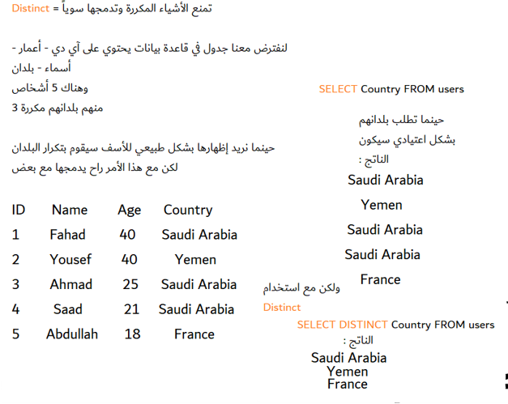
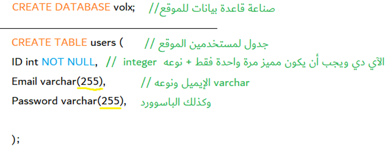

# مقدمة
قواعد البيانات هي مجموعة يتم تنظيم البيانات فيها عبر أنظمة تقنية , وتنقسم لعدة أنواع :

- علائقية Relational
- غير علائقية Non Relational

### قواعد البيانات العلائقية
هي قواعد بيانات يتم تنظيم البيانات فيها بشكل جداول فيها أعمدة وصفوف , يتم التحكم بها بشكل رسمي عبر لغة تدعى SQL


### SQL - Structured Query Language
هي لغة قواعد بيانات تؤدي مهمات إنشاء قواعد البيانات العلائقية وأيضا إستعلامات خاصة لجلب البيانات منها


#### أوامر بسيطة

##### SELECT
وهو أمر الإستعلام البسيط حيث يمكنك جلب البيانات من جدول معين في قاعدة البيانات

```{sql}
SELECT * FROM Table --على حسب اسم الجدول لديك
```

##### DISTINCT
لمنع النتائج المكررة وتضاف بعد أمر SELECT

```{sql}
SELECT DISTINCT Country FROM Users
```



##### WHERE
وهو أمر يحدد الشرط الخاص بالإستعلام

```{sql}
SELECT Names FROM Users
WHERE AGE < 30;
```
الإستعلام أعلى يحدد أسماء المستخدمين الذين أعمارهم أقل من 30 عاماً

### إنشاء قواعد البيانات
يتم ذلك عبر الأوامر التالية :

##### CREATE DATABASE
وهو لإنشاء قاعدة بيانات جديدة

##### CREATE TABLE
وهو لإنشاء جدول جديد في قاعدة البيانات بشرط وضع الحقول الخاصة فيه وأنواعها



<hr>

### أهمية قواعد البيانات
تعد قواعد البيانات مهمة كونه من المستحيل تخزين مئات الآلاف بل والملايين من بيانات المستخدمين والبرمجيات في داخل الكود نفسه , إذ سيأثر على أداء الكود البرمجي هذا غير أنه يعد تصرفاً غير آمناً لذلك يتم اللجوء لقواعد البيانات وخصوصاً العلائقية لقوتها في البيانات النصية والمنظمة . ظهر عدة أشكال في ما بعد تسمي نفسها بالغير علائقية وهي تستخدم تقنيات مختلفة مثل :

- JSON
- XML
- PDF
- CSV

وتعد قواعد البيانات مهارة مهمة لدى عالم ومحلل البيانات وحتى مهندس الذكاء الاصطناعي , وقواعد البيانات تعد من الأشياء الأساسية في علم البيانات كما أنه يتم تدريب الذكاء الاصطناعي على قواعد بيانات تحتوي على بيانات ضخمة جداً فلا بد من إتقان هذه المهارة وخصيصاً أوامر الإستعلام لتتمكن من جلب البيانات من قواعد البيانات بسهولة وأيضاً لتنشئ قواعد بيانات تعتمد عليها في مشاريع الذكاء الاصطناعي وعلم البيانات .

## مصادر ومراجع :
- [ويكيبيديا - قواعد البيانات](https://ar.wikipedia.org/wiki/%D9%82%D8%A7%D8%B9%D8%AF%D8%A9_%D8%A8%D9%8A%D8%A7%D9%86%D8%A7%D8%AA)
- [SQL for Data Science UC Davis - Coursera](https://www.coursera.org/learn/sql-for-data-science)
- [المدرسة - قواعد البيانات في عصر الذكاء الاصطناعي](https://almdrasa.com/%D9%82%D9%88%D8%A7%D8%B9%D8%AF-%D8%A7%D9%84%D8%A8%D9%8A%D8%A7%D9%86%D8%A7%D8%AA-%D9%81%D9%8A-%D8%B9%D8%B5%D8%B1-%D8%A7%D9%84%D8%B0%D9%83%D8%A7%D8%A1-%D8%A7%D9%84%D8%A7%D8%B5%D8%B7%D9%86%D8%A7%D8%B9/)
- Data Science Programming Book - For Dummies
- SQL - For Dummies