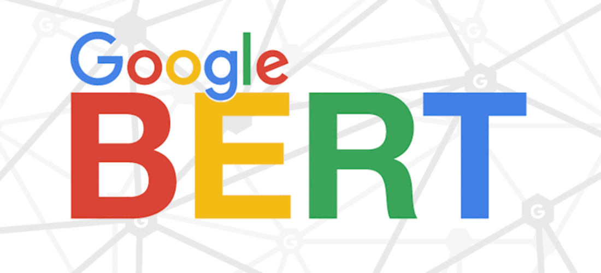
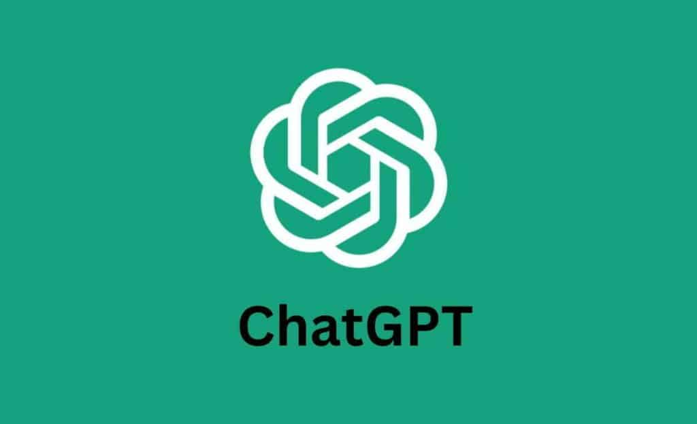
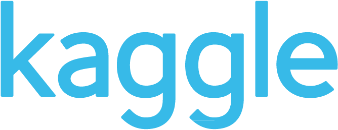

النموذج اللغوي الكبير هو نموذج تعلم عميق قادر على توليد اللغة ومعالجة اللغة الطبيعية وفهم السياق وابداء الآراء وطرح الاسئلة والإجابة عليها كذلك .

غالباً ماتكون النماذج اللغوية الكبيرة هي الصورة النمطية عن الذكاء الاصطناعي في السنوات الأخيرة .

### النشأة والإمكانيات
في الواقع النماذج اللغوية الكبيرة لم تكن ذات شهرة واسعة قبل عقد 2020 الحالي , فقبل ذلك كانت مهمات الذكاء الاصطناعي تقتصر على وظائف قصيرة كالأتمتة وأنظمة التوصيات ولم تصل إلى هذه المرحلة إلا قبل وقت قليل تقريباً .

على مايبدو أن أول نموذجين لغوية كبيرة كانت :

- Google Bert 2018
- GPT-1 2017

 

| صورة بيرت  | صورة جي بي تي 1 |
|--------|--------|
|  |  |

### مميزات
غالباً ماقامت النماذج اللغوية الكبيرة بتسريع المهمات ودفع عجلة التنمية , على الأرجح حتى مفهوم الذكاء الاصطناعي لم ينتشر إلا من بعد إنتشارها وخصوصاً مع "لحظة إطلاق شات جي بي تي 3.5" الشهيرة في نوفمبر 2022 م .

---
غالباً ماتُدرب النماذج اللغوية الكبيرة على بيانات ضخمة تعرف بـ**البيانات الضخمة** تُخزن في قواعد بيانات مختلفة الأنواع وحتى في ملفات نصية ذات صيغٍ مختلفة , وعدد المعاملات في النماذج اللغوية الكبيرة قد يتجاوز المليارات , ومدة التدريب والتكلفة كذلك تكون عالية مقارنة بتكلفة ومدة تدريب النماذج اللغوية الصغيرة والأنواع الأخرى من الذكاء الاصطناعي .

#### بما معناه
أنك يومياً تستخدم نماذج لغوية كبيرة إذا كنت تستخدم شات جي بي تي 5 أو جوجل جيمناي أو ديب سيك أو حتى كلود .

### أمثلة أخرى على نماذج لغوية صغيرة وكبيرة :
- Meta Llama 3.2
- Qwen 2.5
- Google Gemma-2
- OpenAI GPT4o Mini
- Huggingface SmolLM
- TinyLlama

وبسبب إنتشار النماذج اللغوية الكبيرة انتشر استخدام منصات خاصة بهذه النماذج اللغوية الصغيرة والكبيرة مثل :
- Huggingface

 

- Kaggle

 

- Openrouter

 

## مصادر ومراجع :
- [AWS - ماهي النماذج اللغوية الكبيرة ؟](https://aws.amazon.com/ar/what-is/large-language-model/)
- [IBM - What are LLMs?](https://www.ibm.com/think/topics/large-language-models)
- [سدايا - النماذج اللغوية الصغيرة والمتخصصة](https://sdaia.gov.sa/ar/MediaCenter/KnowledgeCenter/ResearchLibrary/SmallAndSpecializedLanguageModels.pdf)
- Deep Learning Book - For Dummies
- [ويكيبيديا - نموذج لغوي كبير](https://ar.wikipedia.org/wiki/%D9%86%D9%85%D9%88%D8%B0%D8%AC_%D9%84%D8%BA%D9%88%D9%8A_%D9%83%D8%A8%D9%8A%D8%B1)
- [Google Developers - LLMS:What are LLMS ?](https://developers.google.com/machine-learning/crash-course/llm/transformers?hl=ar)