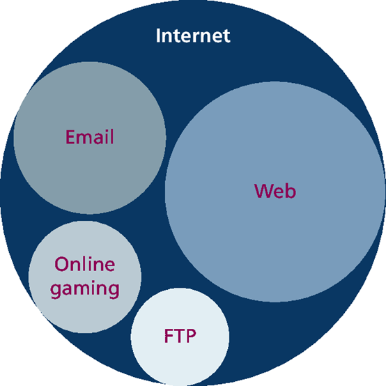
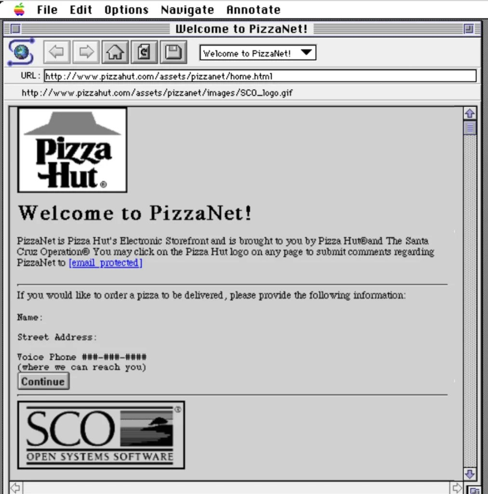
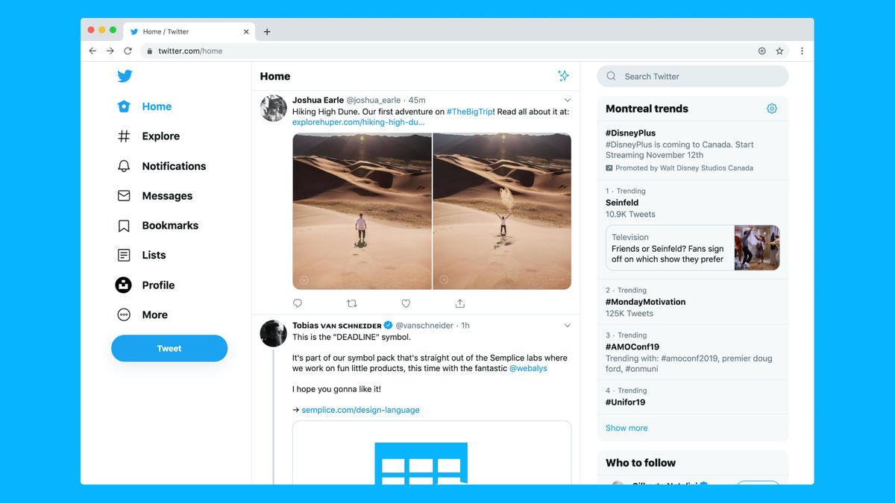
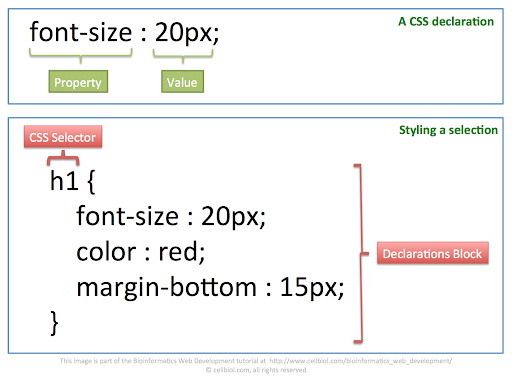
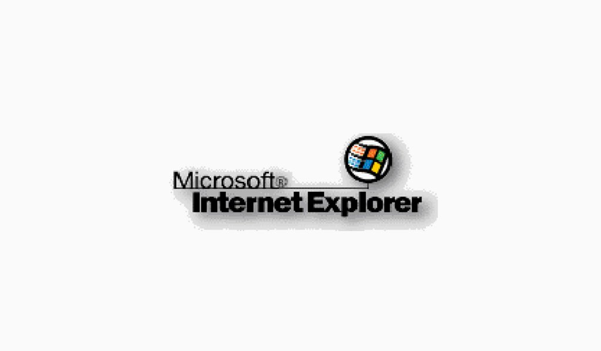

# الإنترنت
حينما نذكر الإنترنت فغالباً يتبادر في اذهاننا شبكة الويب ومواقع التواصل الاجتماعي دون غيرها , وهذا شبه صحيح لكنها ليست الحقيقة الكاملة .

في هذا المقال سنشرح تاريخ الإنترنت وأهم خدماته وأبرزها الويب ثم بروتوكولات الإنترنت وطريقة إتصالات البيانات في مقدمة بسيطة عن عالم الشبكات الحاسوبية ثم تطوير المواقع الإلكترونية .

## ماهو الإنترنت ؟
يجب أن نعلم أولا ماهي الشبكة , والتي سنشرحها بشكل مفصل لاحقاً

الشبكة هي أجهزة مترابطة ببعضها البعض , وقد تكون نوعين :

- LAN / محلية

- WAN / موسعة

بحيث الموسعة هي مجموعة شبكات محلية مرتبطة ببعضها البعض

هناك أجهزة خاصة بالشبكة مثل الراوتر والمودم والهب والسويتش والتي لن نتكلم عنها الليلة , أما الإنترنت فهي أكبر شبكة حاسوبية معروفة لدينا حالياً بتاريخنا البشري وهي :

**شبكة الشبكات**

حيث ترتبط عبر الأقمار الصناعية والأسلاك والكيابل الضخمة الممتدة تحت البحار وبأبراج الإتصالات

أبرز خدمات الإنترنت هي :

- شبكة الويب
- خدمات الإيميل
- خدمات نقل الملفات
- الألعاب الإلكترونية

وغيرها الكثير.

## ماهو الويب ؟

الشبكة العنكبوتية العالمية أو ماتسمى بـ :

**WWW**

أو إختصاراً لـ :

**World Wide Web**

وهي أبرز خدمات الإنترنت , لدرجة أنها أصبحت هي الصورة النمطية للإنترنت , بل أبرزها حيث أنه بسبب شهرتها وقوتها تم دمج الكثير من الخدمات المنافسة فيها مثل خدمات الإيميل والألعاب الإلكترونية في القرن الواحد والعشرون.

كانت من إختراع "تيم بيرنر لي" عام 1989-1991 م والذي أخترع أيضاً كلاً من :

- HTTP : البروتوكول الرسمي لمواقع الويب في الشبكة العنكبوتية ويحمل المنفذ 80

- HTML : لغة توصيفية لبناء وإنشاء هياكل مواقع الويب

- URL : الرابط الرسمي الخاص بموقعك في الشبكة

- Browser : المتصفح وهو البرنامج الرئيسي الذي يمكنك من دخول شبكة الويب

- Web server : الخادم الذي يمكنه إحتواء مواقع الويب

### البروتوكول
وهو سلسلة من القواعد تستخدم للتواصل

مثلاً

HTTP/HTTPS : لعالم الويب

FTP : لنقل الملفات

TCP/UDP : للتحكم في طبقة النقل وهي الطبقة الرابعة من طبقة الشبكات وسنفصلها لاحقاً

### HTML
وهي اللغة الأساسية لمواقع الويب , وهي ليست لغة برمجة بالمعنى الحرفي مع أنه يتم معاملتها بهذا الشكل مؤخراً

وهي اللغة المسؤولة عن بناء هياكل مواقع الويب الإلكترونية وهي سهلة التعلم وهي اللغة الوحيدة التي يفهمها المتصفح لكي يعرض لك الموقع الإلكتروني

طريقة الكتابة تتم بين علامتي :

`<>`

أو ماتسمى بال

**Tags**

فهنا مثلا هيكل لموقع ويب بسيط

``<!DOCTYPE html>``
نعرف الموقع بأن الملف اتش تي ام ال

``<html lang="en">``
نعرف المتصفح أن الاتش تي ام ال إنجليزي مثلاً

``<head>``
بداية أمر رأس المتصفح والأوامر التابعة له مثل :

``<title>``

ويجب إغلاق أمر الرأس بهذا الشكل لاحقاً :

``</head>``

ثم وسم جسد الموقع وهو يحتوي كل موقعك تقريباً :

``<body>``

وهنا تضع مثلا الأوامر الخاصة بموقعك

لنضع مثلاً عنوان نصي كبير

``<h1>أهلا</h1>``
حيث ستظهر بهذا الشكل :

# أهلا

ولديك ستة عناوين من الأكبر للأصغر

# H1
## H2
### H3
#### H4
##### H5
###### H6

وأيضا وسم النصوص الطويلة

``
ذهبنا مع أبي لتناول العشاء ليلة البارحة وكانت رحلة ممتعة
``

وهي إختصاراً لـ :

**Paragraph**

ثم تنهي موقعك بوسم اغلاق الجسد واغلاق الملف

``</body>``
``</html>``

طبعاً كل المواقع كانت ذات شكل بدائي وتستخدم فقط اتش تي ام ال لكن الثورة الكبرى هي إختراع أهم شيء مع  وهو 

### CSS

Cascading Style sheets

أو جداول التحسين المتراكمة

وهي لغة توصيفية أخرى تضاف للاتش تي ام ال لتزيين الموقع وتحسين شكله

وسنطول بشرحها

وإن كان الاتش تي ام ال الهيكل العظمي للإنسان فالسي اس اس هي الجلد الخارجي له

أما الجافاسكريبت فهي الجهاز العصبي , ولغات الباك اند فهي المخ

### Javascript

في التسعينات بدأت "حرب المتصفحات" وهي حرب متصفحات من عدة شركات كان أبرزها الحرب بين نتسكيب ومتصفح إنترنت أكسبلورر من شركة مايكروسوفت.

وكانت الحرب في من يقدم خدمات ويدعم أفكاراً أكثر لدرجة أنهم وصلوا لمرحلة جنونية "مثل إمكانية استخدام جافا في الفرونت اند" والتي خلقت ثغرات جديدة .

| صورة نتسكيب  | صورة اكسبلورر |
|--------|--------|
|  |  |

ما خلق ثورة جديدة في عالم الويب هو ظهور لغة "جافاسكريبت" في الفرونت اند والتي سميت تيمناً بلغة جافا الشهيرة أنذاك , اللغة هذه قوية ونقلت عالم الويب من ثابت "سطحي" إلى متحرك "ديناميكي" .

تلى ذلك ظهور لغات للسيرفر "باك اند" وأشهرها بي اتش بي والتي تعد لازالت أشهر لغة في هذا المجال.

لغة بي اتش بي , أنشئت قوة جديدة للويب حيث تمكنت المواقع بربطها بسهولة مع قواعد بيانات ماي اس كيو ال وتحول الويب من مواقع سطحية إلى عالم جديد غير هندسة البرمجيات التقليدية حرفياً .

### لماذا ؟

مع ظهور الويب تطبيقات الويب , وهي البرمجيات التي تم تطويرها مبنيةً على الويب مباشرة وكانت نقلة نوعية لعدة أسباب :

- عدم إجبار المستخدم على تحديث البرنامج أو تحميل نسخة أخرى

- التحديث فوري

- أسهل للمطور والمستخدم

- غير ضروري تنزيل البرنامج على جهازك

ومع ذلك خلقت مخاطر أقوى من السابق , كلفت العديد من الشركات الثمن الغالي وأنشئت مجالات جديدة في سوق العمل .

كعالم بيانات أو مهندس ذكاء اصطناعي مهارة الويب أصبحت أمر واجب عليك معرفته كي تستطيع التعامل معه بسهولة في استضافة مشاريعك وإنشاء موقع شخصي لك يحمل سيرتك الذاتية .

النهاية...

## مصادر ومراجع :
- [W3C - Web](https://www.w3.org/)
- [Wikipedia - World Wide Web](https://en.wikipedia.org/wiki/World_Wide_Web)
- [IBM - Introduction to HTML, CSS, & JavaScript on Coursera](https://www.coursera.org/learn/introduction-html-css-javascript)
- Web development and programming - For Dummies
