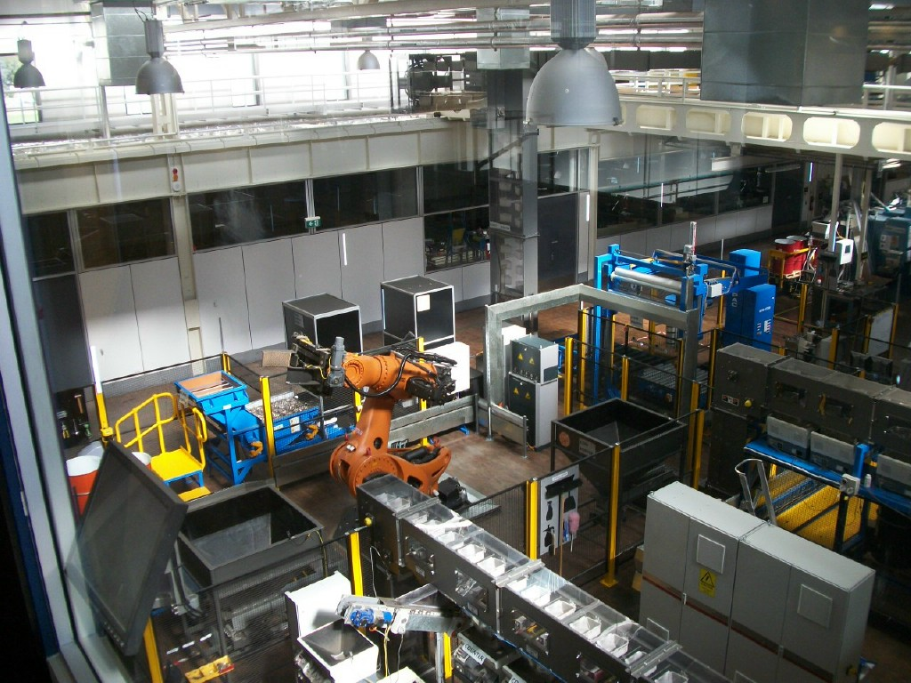

# مقدمة
الأتمتة أو التشغيل الآلي معربة ومأخوذة من مصطلح تشغيل أوتوماتيكي , وهي عملية شائعة لتحويل أداء المهام الروتينية من الشكل اليدوي إلى الشكل الأوتوماتيكي أو الإلكتروني .



## خلفية عامة
في عالم البرمجة والذكاء الاصطناعي غالباً مايقصد بالأتمتة الكود البرمجي الذي يقوم بعمل المهام اليومية بشكل أوتوماتيكي بدون تدخل بشري مباشر . وغالباً مايقوم المبرمجين بعمل هذه الأكواد لأداء المهام المملة أو لأداء مهمات مختلفة في وقت واحد

### فوائد ومزايا الأتمتة

1. توفير الوقت والجهد

2. أداء مهمات مختلفة في وقت واحد

3. عدم تضييع الوقت في أداء أمور روتينية مملة

### عيوب الأتمتة
طالما لكل شيء مزايا فيجب أن يكون له عيوب وهذه أبرزها :

1. زيادة الكسل العام لدى المطورين والمبرمجين

2. المشاكل التقنية المفاجئة التي من الممكن أن لاينتبه إليها المطورين

3. الثغرات الأمنية

### الأتمتة في البرمجة
الأتمتة في البرمجة , كما ذكرنا هي أكواد برمجية يتم تجهيزها لأداء مهمات يومية وغالبا مايتم ذلك عبر لغة بايثون

مثال على كود أتمتة بلغة بايثون :
```{python}
import os

# Path of files
folder = "test"

count = 1

for filename in os.listdir(folder):
    old_path = os.path.join(folder, filename)

    if os.path.isfile(old_path):
        # نحصل على الامتداد (مثلاً .jpg أو .txt)
        ext = os.path.splitext(filename)[1]

    # New name of files
        new_name = f"file_{count}{ext}"
        new_path = os.path.join(folder, new_name)

        # Rename
        os.rename(old_path, new_path)
        print(f"success {filename} → {new_name}")
        count += 1

print("Filenames rename success")

```

وهنا مشروع أتمتة خاص فيني يقوم بتنزيل صورة سيارة عشوائية من داتاسيت داخل الكود في سيرفر الديسكورد

[randomcars](https://github.com/Saad711T/randomcars)


### الأتمتة والذكاء الاصطناعي
غالباً ماتتطور أنظمة الأتمتة إلى أنظمة مدعومة بالذكاء الاصطناعي , أو أحياناً يتم إعتماد الذكاء الاصطناعي في أداء المهام اليومية بشكل مؤتمت ويومي وروتيني .

## مصادر ومراجع :
- [ويكيبيديا - تشغيل ذاتي](https://ar.wikipedia.org/wiki/%D8%AA%D8%B4%D8%BA%D9%8A%D9%84_%D8%B0%D8%A7%D8%AA%D9%8A)
- [AWS - ماهي الأتمتة الذكية ؟](https://aws.amazon.com/ar/what-is/intelligent-automation/)
