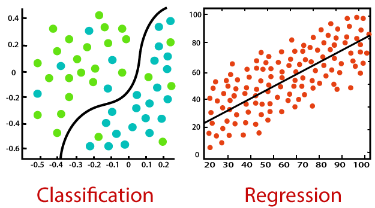
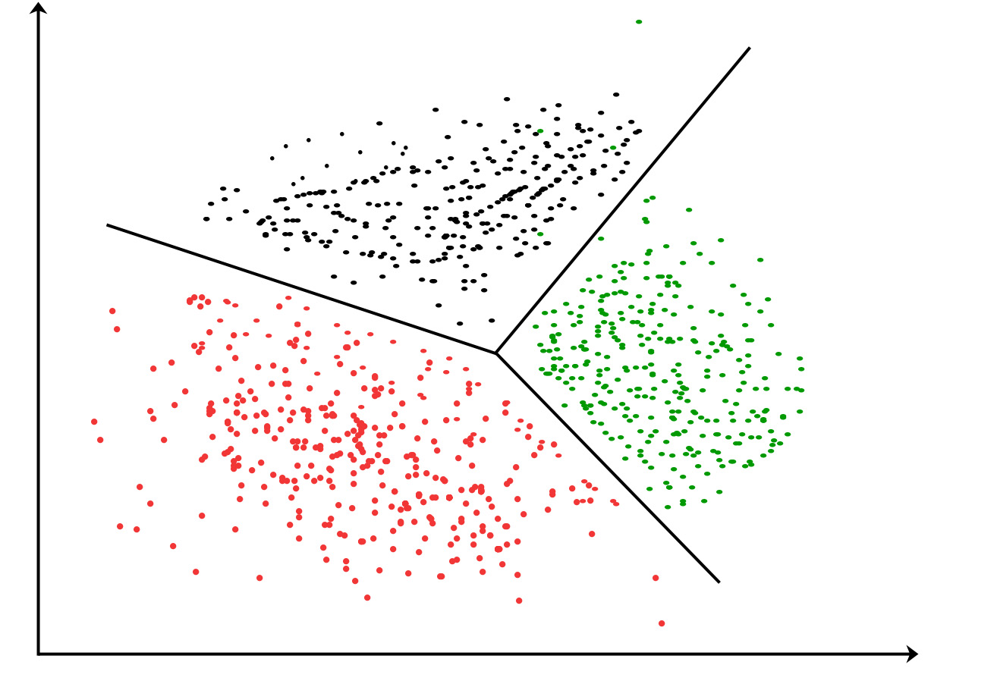
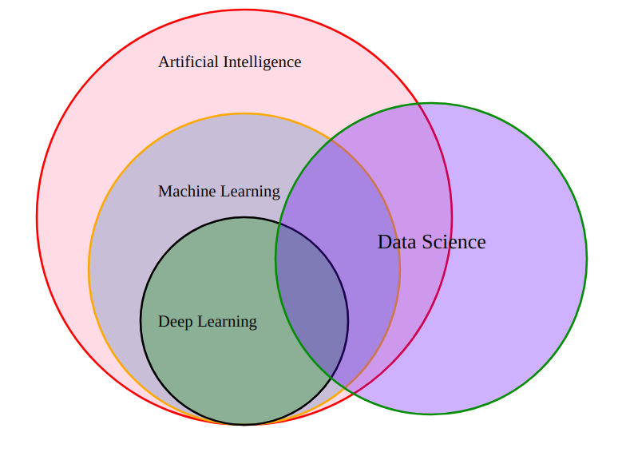
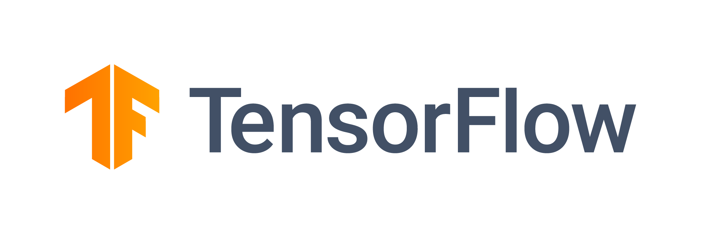
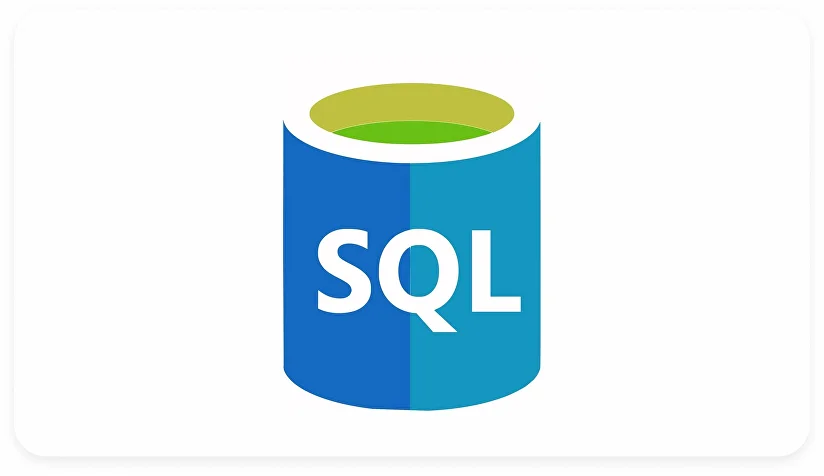

# مقدمة
تعلم الآلة هي التقنية الأشهر والرئيسية لتعليم الذكاء الإصطناعي , بل أنه التعلم العميق يعد جزئاً منها .

## الأسس والتقنيات
تعلم الآلة غالباً ما يتم إستخدام الخوارزميات المتقدمة لتعليم الآلة من البيانات المجهزة مسبقاً .
وهذه أبرز الخوارزميات المستعملة في تعلم الآلة :

1. خوارزميات تعلم آلة مشرف عليها

- Regression / الإنحدار

يتم في خوارزمية الإنحدار التنبؤ بالقيم المستمرة عن طريق بناء علاقة بين متغيرات الإدخال المستقلة ومتغيرات الإخراج التابعة للإدخال .

- Classification / التصنيف

في خوارزمية التصنيف يتم تصنيف وفرز البيانات بناء على نوعها المحدد بشكل مسبق , تعمل الخوارزمية على بيانات مصنفة مسبقاً للتنبؤ فئة الشيء الجديد بناء على صفاته .

2. خوارزميات تعلم آلة بدون الإشراف عليها

- Clustering / التجميع

تعد خوارزمية التجميع جزء من خوارزمية التصنيف , لكنها بتعلم آلة غير مشرف عليها حيث من المفترض أن الآلة هي من تصنف وتفرز ولايتم تصنيف البيانات مسبقاً كما هو الحال في خوارزمية التصنيف .

### تعلم الآلة ضد التعلم العميق

التعلم العميق هو أسلوب من أساليب تعلم الآلة لكنه مخصص أكثر ويتم إستخدام فيه `الشبكات العصبية` وهو موضوع سيتم طرحه لاحقاً بإذن الله , بينما تعلم الآلة يعتمد على الخوارزميات أكثر ويتم الإشراف عليه غالباً .

## أشهر مكتبات تعلم الآلة :

- Scikit learn

من أشهر مكتبات تعلم الآلة مفتوحة المصدر , والتي تم استعراضها لأول مرة في معرض جوجل الصيفي للبرمجة عام 2007 م . وتطورت كثيراً منذ ذلك الحين حتى أصبحت تدعم كذلك الشبكات العصبية.

- TensorFlow

مكتبة تم تطويرها من قبل جوجل , وهي من أشهر المكتبات الخاصة بتعلم الآلة المتقدم وجزئياً التعلم العميق والشبكات العصبية. وهي تدعم عدة لغات مثل بايثون وسي بلس بلس.

- PyTorch

مكتبة بايثون مفتوحة المصدر تم تطويرها من قبل الباحثين في فيسبوك/ميتا عام 2016 . المكتبة تعد المنافس الرسمي لتينسور فلو ومتخصصة في تعلم الآلة المتقدم والتعلم العميق.

### أنواع البيانات لتدريب النماذج

- SQL

قواعد بيانات علائقية تُكتب بلغة اس كيو إل , وتم شرحها مسبقاً :

[لمحة عن قواعد البيانات](post26.qmd)

- XLSX

الصيغة الرئيسية لملفات جداول بيانات مايكروسوفت إكسل.

- CSV

ملفات نصية مرتبة كجداول بيانات , وهي من أفضل صيغ الملفات الخاصة بتعلم الآلة والتعلم العميق.

## مصادر ومراجع :
- [Coursera - IBM Machine learning with python](https://www.coursera.org/learn/machine-learning-with-python)
- [Wikipedia - Machine learning](https://en.wikipedia.org/wiki/Machine_learning)
- [IBM - What is machine learning ?](https://www.ibm.com/think/topics/machine-learning)
- Deep Learning Book - For Dummies
- [IBM - Machine learning algorithms](https://www.ibm.com/think/topics/machine-learning-algorithms)
- [أكاديمية حسوب - تعلم الآلة](https://academy.hsoub.com/programming/artificial-intelligence/%D8%AA%D8%B9%D9%84%D9%85-%D8%A7%D9%84%D8%A2%D9%84%D8%A9/)