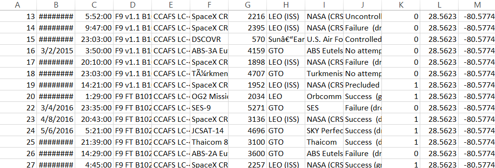
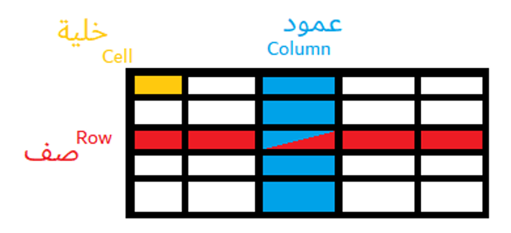

# مقدمة
تحليل البيانات يعد من أهم المجالات المطلوبة في عصرنا الحالي , ومن أهم الوظائف والمهارات في عالم الذكاء الاصطناعي والتي سنشرحها في هذا المقال.

## نظرة مفصلة
عملية تحليل البيانات مهمة جداً وتحتوي على تنظيف البيانات وانتقائها وتصويرها وحتى نمذجتها وتجهيزها وإستنتاج النتائج منها .

يعد مجال تحليل البيانات من أشهر المجالات نجاحاً في القرن الواحد والعشرين , ويعتمد عليه الكثير من الشركات والمؤسسات وأصبح من أكثر الوظائف دخلاً في القرن الواحد والعشرون .

ويتعامل محلل البيانات غالباً مع جداول البيانات ممثلة في برامج مثل مايكروسوفت إكسل وجداول بيانات جوجل , وأحياناً يكون محلل البيانات متقدم بما فيها الكفاية ليتعامل مع قواعد البيانات مباشرة وأيضاً البرمجة بلغة بايثون وتحديداً مكتبة بانداس .

[لمحة عن قواعد البيانات](post26.qmd)

### أهمية تحليل البيانات في الذكاء الاصطناعي
تحليل البيانات تعتبر المرحلة الأولية والمبدئية لما قبل تدريب النموذج , إذ أنه من المحتمل أن تكون وظيفة محلل البيانات فحص البيانات وإستنتاج النتائج المطلوبة منها وتصويرها على أشكال هندسية معينة لكي يتأكد من جاهزية إعطائها للنموذج .

كذلك هناك وظيفة مهندس البيانات المرتبطة بمحلل البيانات لكنها متخصصة أكثر في البنية التحتية للبيانات وضمان تسليمها للطاقم المطلوب بشكل ممتاز .

على محلل البيانات أيضاً معرفة أسباب تحليل البيانات هذه بطرق عدة منها الوصفية والإستنتاجية , ويعتبر تحليل البيانات المقدمة الأهم لعلم البيانات وعالم الذكاء الاصطناعي .

## مصادر ومراجع :
- [ويكيبيديا - تحليل بيانات](https://ar.wikipedia.org/wiki/%D8%AA%D8%AD)
- Data Science Programming Book - For Dummies
- [AWS - ماهي تحليلات البيانات ؟](https://aws.amazon.com/ar/what-is/data-analytics/)